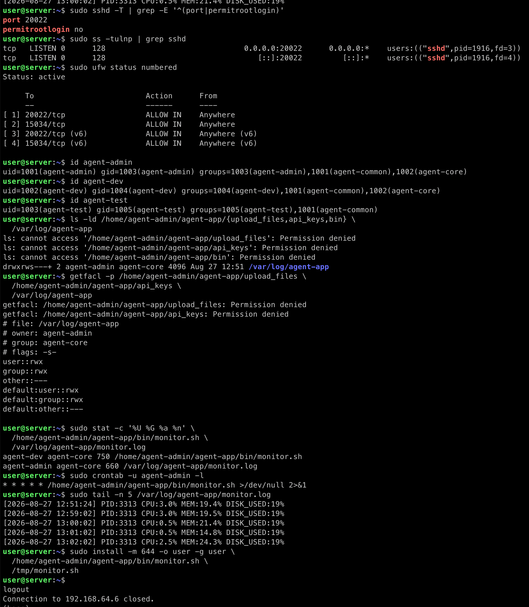

# 1-1. 컴퓨터가 알아서 자기 상태를 점검하게 만들기

Ubuntu Server 환경에서 기본 보안, 역할 기반 권한, 제공 애플리케이션 실행 환경, 시스템 모니터링과 cron 자동 실행을 구성한 수행 내역서다.

자동화 스크립트는 [monitor.sh](monitor.sh)에 있다. 구현의 배경과 평가 설명을 위한 [초심자용 서버 관제 학습 가이드](docs/beginner-guide.md)도 함께 제공한다.

## 최종 검증 캡처

최종 설정과 자동 실행 결과는 아래 캡처에도 보관했다.



캡처에서는 SSH가 `20022`에서 LISTEN하고 Root 원격 로그인이 차단된 것, UFW의 두 허용 포트, 계정별 그룹, `monitor.sh` 권한, cron 등록, 그리고 1분마다 늘어난 로그를 확인할 수 있다. `user` 계정이 `$AGENT_HOME` 아래의 `bin`, `api_keys`, `upload_files`를 조회할 때 나타난 `Permission denied`는 의도된 결과다. `user`는 `agent-common`이나 `agent-core`에 속하지 않으므로 해당 서비스 디렉터리를 탐색할 권한이 없다. ACL 상세값은 권한이 있는 계정 또는 `sudo getfacl`로 확인한다.

## 실행 환경

- Host: Apple Silicon Mac + UTM
- Guest OS: Ubuntu Server 22.04 ARM64
- 초기 관리자 계정: `user`
- 앱 실행 계정: `agent-admin`
- 애플리케이션: 제공된 `agent-app-linux-arm64` ELF 실행 파일

## 1. 기본 보안과 네트워크

### SSH

`/etc/ssh/sshd_config.d/00-codyssey.conf`에 다음 설정을 추가했다.

```text
Port 20022
PermitRootLogin no
```

설정 문법을 확인한 후 SSH 서비스를 재시작했다.

```bash
sudo sshd -t
sudo systemctl restart ssh
sudo sshd -T | grep -E '^(port|permitrootlogin)'
sudo ss -tulnp | grep sshd
```

확인 결과는 `port 20022`, `permitrootlogin no`, `0.0.0.0:20022` LISTEN이다. 이후 맥에서 다음 명령으로 접속했다.

```bash
ssh -p 20022 user@192.168.64.6
```

### UFW

외부에서 들어오는 연결은 기본 거부하고, SSH와 애플리케이션 포트만 허용했다.

```bash
sudo ufw default deny incoming
sudo ufw default allow outgoing
sudo ufw allow 20022/tcp
sudo ufw allow 15034/tcp
sudo ufw --force enable
sudo ufw status numbered
```

`ufw status numbered`에서 `20022/tcp`, `15034/tcp`만 `ALLOW IN`으로 확인했다. IPv6에 대한 같은 두 규칙은 UFW가 함께 생성한다.

## 2. 계정, 그룹, ACL

### 계정과 그룹

| 구분 | 구성 |
| --- | --- |
| 계정 | `agent-admin`, `agent-dev`, `agent-test` |
| `agent-common` | `agent-admin`, `agent-dev`, `agent-test` |
| `agent-core` | `agent-admin`, `agent-dev` |

계정은 서비스용 계정으로 만들었으며, `user` 계정에는 과제 디렉터리 접근 권한을 부여하지 않았다.

```bash
id agent-admin
id agent-dev
id agent-test
```

### 디렉터리 권한 정책

`AGENT_HOME`은 `/home/agent-admin/agent-app`이다.

| 경로 | 소유자:그룹 | 권한 | 접근 의도 |
| --- | --- | --- | --- |
| `/home/agent-admin` | `agent-admin:agent-admin` | `750` + ACL | `agent-common`에 탐색(`--x`)만 허용 |
| `$AGENT_HOME` | `agent-admin:agent-common` | `2750` | 공통 구성원이 읽고 하위 디렉터리로 이동 가능 |
| `$AGENT_HOME/bin` | `agent-dev:agent-core` | `2750` | 개발자가 스크립트를 작성하고 core만 실행 가능 |
| `$AGENT_HOME/upload_files` | `agent-admin:agent-common` | `2770` | 세 역할이 읽기·쓰기 가능 |
| `$AGENT_HOME/api_keys` | `agent-admin:agent-core` | `2770` | admin/dev만 읽기·쓰기 가능 |
| `/var/log/agent-app` | `agent-admin:agent-core` | `2770` | admin/dev만 로그를 기록·조회 가능 |

`2`로 시작하는 권한은 setgid 비트다. 새 파일이 디렉터리의 그룹을 상속하게 만든다. 세 공유/보안 디렉터리에는 기본 ACL도 적용하여 새로 생성되는 파일과 디렉터리에 `rwx`/`---` 정책이 이어지게 했다.

```bash
getfacl -p /home/agent-admin/agent-app/upload_files \
  /home/agent-admin/agent-app/api_keys \
  /var/log/agent-app
```

이 구조는 `agent-test`가 업로드 파일에는 협업할 수 있지만 키와 운영 로그에는 접근하지 못하도록 분리한다.

## 3. 애플리케이션 실행 환경

`agent-admin`의 `~/.profile`에 다음 환경 변수를 설정했다.

```bash
export AGENT_HOME=/home/agent-admin/agent-app
export AGENT_PORT=15034
export AGENT_UPLOAD_DIR=/home/agent-admin/agent-app/upload_files
export AGENT_KEY_PATH=/home/agent-admin/agent-app/api_keys
export AGENT_LOG_DIR=/var/log/agent-app
```

제공 압축 파일에는 x86과 ARM64 실행 파일이 함께 들어 있었다. Apple Silicon 기반 Ubuntu VM에서는 ARM64 파일만 배치했다.

```bash
sudo -u agent-admin unzip -j /tmp/agent-app.zip \
  agent-app-linux-arm64 -d /home/agent-admin/agent-app
```

`file agent-app-linux-arm64`의 결과는 `ELF 64-bit ... ARM aarch64`였다.

### 키 파일 호환 처리

과제 요구사항에 따라 아래 파일을 만들고 내용으로 `agent_api_key_test` 한 줄을 기록했다.

```text
/home/agent-admin/agent-app/api_keys/t_secret.key
```

제공 바이너리는 문서와 달리 `AGENT_KEY_PATH`에 키 파일 대신 `api_keys` 디렉터리를 요구하고, 그 안의 `secret.key`를 검사했다. 요구사항 파일을 보존하면서 같은 파일을 참조하도록 하드 링크를 만들었다.

```bash
cd /home/agent-admin/agent-app/api_keys
ln t_secret.key secret.key
```

따라서 `t_secret.key`와 `secret.key`는 같은 inode와 권한(`agent-admin:agent-core`, `660`)을 공유한다. 이 차이는 제공 바이너리의 실제 검증 조건에 맞춘 호환 처리다.

### Boot Sequence 확인

일반 계정인 `agent-admin`으로 앱을 실행했다.

```bash
sudo -iu agent-admin
source ~/.profile
cd "$AGENT_HOME"
./agent-app-linux-arm64
```

다음 결과를 확인했다.

```text
[1/5] Checking User Account               [OK]
[2/5] Verifying Environment Variables     [OK]
[3/5] Checking Required Files             [OK]
[4/5] Checking Port Availability          [OK]
[5/5] Verifying Log Permission            [OK]
All Boot Checks Passed!
Agent READY
```

앱은 `0.0.0.0:15034`에서 LISTEN 상태가 됐고, 종료는 실행 터미널에서 `Ctrl+C`로 수행했다.

## 4. 시스템 관제 자동화

### monitor.sh

스크립트의 VM 경로는 다음과 같고, 제출용 사본은 [monitor.sh](monitor.sh)에 보관했다.

```text
/home/agent-admin/agent-app/bin/monitor.sh
소유자: agent-dev:agent-core
권한: 750 (rwxr-x---)
```

스크립트는 실제 제공 앱 파일명인 `agent-app-linux-arm64`를 대상으로 다음을 수행한다.

1. `pgrep -f`로 프로세스를 확인하고 없으면 `exit 1` 한다.
2. `ss -ltnH`로 TCP 15034 LISTEN 상태를 확인하고 없으면 `exit 1` 한다.
3. UFW 활성화 상태를 확인한다. 비활성 또는 조회 불가 시에는 `[WARNING]`만 출력한다.
4. `/proc/stat`의 두 시점 차이로 CPU 사용률을 계산하고, `free`, `df`로 메모리와 루트 파티션 사용률을 수집한다.
5. CPU `> 20%`, 메모리 `> 10%`, 디스크 `> 80%`일 때 경고를 출력한다.
6. 아래 형식으로 `/var/log/agent-app/monitor.log`에 누적한다.

```text
[YYYY-MM-DD HH:MM:SS] PID:... CPU:..% MEM:..% DISK_USED:..%
```

동시 실행은 `flock`으로 막았다. 로그가 10MB 이상이면 현재 파일을 `.1`로 회전하고, `.1`부터 `.9`까지 유지한다. 즉 현재 로그를 포함해 최대 10개 파일을 관리한다.

`monitor.sh`가 cron에서 비밀번호 입력 없이 UFW 상태만 읽을 수 있도록 아래처럼 최소 권한 sudo 규칙을 추가했다.

```text
agent-admin ALL=(root) NOPASSWD: /usr/sbin/ufw status
```

수동 실행 결과는 다음과 같았다.

```text
Checking process 'agent-app-linux-arm64'... [OK] (PID: 3313)
Checking port 15034... [OK]
Firewall status... [OK]
CPU Usage : 3.0%
MEM Usage : 19.4%
DISK Used : 19%
[WARNING] MEM threshold exceeded (19.4% > 10%)
[INFO] Log appended: /var/log/agent-app/monitor.log
```

로그 기록도 확인했다.

```text
[2026-08-27 12:51:24] PID:3313 CPU:3.0% MEM:19.4% DISK_USED:19%
```

## 5. cron 자동 실행

`agent-admin`의 crontab에 다음 작업을 등록했다.

```cron
* * * * * /home/agent-admin/agent-app/bin/monitor.sh >/dev/null 2>&1
```

확인 명령은 다음과 같다.

```bash
sudo crontab -u agent-admin -l
sudo tail -n 5 /var/log/agent-app/monitor.log
```

수동 실행 후, cron이 자동으로 추가한 로그를 확인했다.

```text
[2026-08-27 12:51:24] PID:3313 CPU:3.0% MEM:19.4% DISK_USED:19%
[2026-08-27 12:59:02] PID:3313 CPU:3.0% MEM:19.5% DISK_USED:19%
[2026-08-27 13:00:02] PID:3313 CPU:0.5% MEM:21.4% DISK_USED:19%
```

## 핵심 개념 정리

### SSH 포트 변경과 Root 원격 로그인을 막는 이유

기본 포트를 바꾸는 것은 무차별 대입 시도의 노출을 줄이는 보조 수단이다. 더 중요한 것은 Root 계정의 원격 로그인을 차단해, 계정 탈취가 곧바로 시스템 전체 권한 탈취로 이어지지 않도록 하는 것이다. 일반 계정으로 로그인한 뒤 필요한 작업만 `sudo`로 올리는 방식이 추적성과 최소 권한에 유리하다.

### 필요한 포트만 열어야 하는 이유

방화벽의 기본 정책을 inbound deny로 두면, 실수로 실행된 서비스도 외부에 노출되지 않는다. 이 과제에서는 관리용 SSH(20022)와 앱(15034)만 허용했다.

### 그룹과 ACL을 나눈 이유

공유 업로드는 QA까지 협업해야 하지만, API 키와 운영 로그는 개발·운영 역할만 다뤄야 한다. 그룹은 역할 단위 권한을 간결하게 관리하고, ACL은 부모 디렉터리의 탐색 권한과 새 파일의 기본 권한처럼 세밀한 예외를 표현한다.

### 환경 변수를 쓰는 이유

실행 경로와 포트를 코드에 고정하지 않고 환경 변수로 분리하면, 같은 실행 파일을 다른 계정·경로·환경에서도 일관되게 실행할 수 있다. 실행 전 `env | grep '^AGENT_'`와 키·로그 디렉터리 접근 검사를 통해 값과 권한을 검증했다.

### 로그 보존 정책이 필요한 이유

로그를 남기지 않으면 장애 시점의 CPU, 메모리, 디스크 상태를 복원하기 어렵다. 반대로 무한히 쌓으면 디스크를 소진할 수 있으므로, 용량 기준 회전과 파일 개수 제한으로 추적 가능성과 디스크 안전성을 함께 유지했다.
