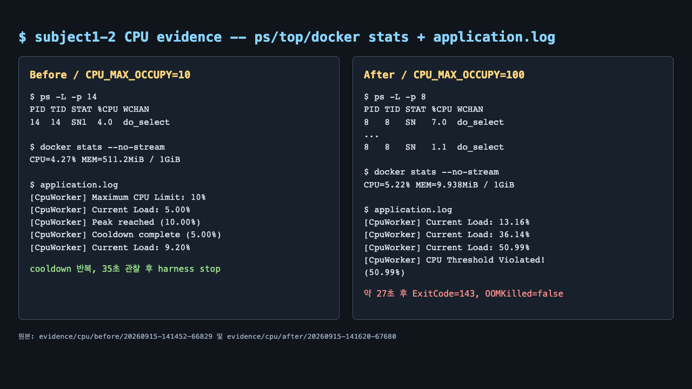

# [Bug] CPU 과점유 - CPU 보호 임계치 초과에 따른 프로세스 종료

## 1. Description (현상 설명)

`agent-leak-app`의 `CpuWorker`가 설정값에 따라 CPU 작업량을 올리다가 임계치를 넘으면 종료되는 현상을 분석했다. `monitor.sh`, `ps`, `top -H`, `docker stats`를 함께 수집하고, 앱이 직접 기록한 `Current Load`도 비교했다.

- 계획표 Before: `CPU_MAX_OCCUPY=10`, `MEMORY_LIMIT=512`, `MULTI_THREAD_ENABLE=false`
- 계획표 After: `CPU_MAX_OCCUPY=100`, 나머지 조건 고정
- 계획표 비교에서 10%는 정상 baseline이고 100%에서 과점유 보호 동작을 재현했다.
- 실제 우회 검증은 100% -> 10%로 별도 실행했다. 리포트의 After=100은 계획표대로 장애를 노출한 비교이고, Workaround는 10%로 되돌린 결과다.

## 2. Evidence & Logs (증거 자료)

계획표 비교 원본:

- [Before metadata: CPU 10%](../evidence/cpu/before/20260915-141452-66829/run-metadata.txt)
- [Before application.log](../evidence/cpu/before/20260915-141452-66829/application.log)
- [Before observations.log](../evidence/cpu/before/20260915-141452-66829/observations.log)
- [After metadata: CPU 100%](../evidence/cpu/after/20260915-141620-67680/run-metadata.txt)
- [After application.log](../evidence/cpu/after/20260915-141620-67680/application.log)
- [After observations.log](../evidence/cpu/after/20260915-141620-67680/observations.log)
- [After container-inspect.json](../evidence/cpu/after/20260915-141620-67680/container-inspect.json)

우회 검증 원본:

- [100% 실행 application.log](../evidence/cpu/before/20260915-140355-62651/application.log)
- [10% 실행 application.log](../evidence/cpu/after/20260915-140458-63304/application.log)

### 계획표 Before: 10%

앱은 안정 모드로 전환되어 `Peak reached (10.00%). Starting cooldown`과 `Cooldown complete (5.00%)`을 반복했다. 35초 관찰 동안 종료 임계치 로그는 없었다.

~~~text
2026-09-15 05:14:57,520 [INFO] >>> Scenario Selected: [Healthy System Monitoring]
2026-09-15 05:14:58,373 [INFO] [CpuWorker] Started. Maximum CPU Limit: 10%
2026-09-15 05:14:58,373 [INFO] [CpuWorker] Current Load: 5.00%
2026-09-15 05:15:03,615 [INFO] [CpuWorker] Peak reached (10.00%). Starting cooldown...
2026-09-15 05:15:06,729 [INFO] [CpuWorker] Cooldown complete (5.00%). Resuming load increase...
2026-09-15 05:15:58,868 [WARNING] [MemoryWorker] Memory Usage Reached Limit (525MB). Starting cleanup...
2026-09-15 05:16:00,841 [INFO] [CpuWorker] Current Load: 9.20%
~~~

`observations.log`의 프로세스 관제에서도 PID 14가 유지되고 RSS가 16.4MB에서 416.7MB까지 증가했지만 CPU 누적값은 약 0.7~2.2% 범위였다. `docker stats`의 순간 컨테이너 CPU는 최대 4.27%였다. 이 실행의 메모리 증가는 OOM 보고서에서 별도로 다룬다.

### 계획표 After: 100%

`CPU_MAX_OCCUPY=100`으로 바꾸자 앱의 `Current Load`가 5.00%에서 50.99%까지 상승했고 약 27초 뒤 임계치 로그를 남겼다.

~~~text
2026-09-15 05:16:25,212 [INFO] [CpuWorker] Started. Maximum CPU Limit: 100%
2026-09-15 05:16:25,212 [INFO] [CpuWorker] Current Load: 5.00%
2026-09-15 05:16:28,330 [INFO] [CpuWorker] Current Load: 13.16%
2026-09-15 05:16:34,578 [INFO] [CpuWorker] Current Load: 25.71%
2026-09-15 05:16:43,958 [INFO] [CpuWorker] Current Load: 36.14%
2026-09-15 05:16:50,199 [INFO] [CpuWorker] Current Load: 50.99%
2026-09-15 05:16:50,301 [CRITICAL] [CpuWorker] CPU Threshold Violated! (50.99%).
~~~

해당 실행의 `ps -L`는 PID 8의 CPU가 7.0% -> 1.1%로 관측되었고, 마지막 `docker stats`는 컨테이너 CPU 5.22%를 기록했다. 단일 순간 샘플보다 앱의 누적 `Current Load` 상승 로그가 작업량 증가를 더 직접적으로 보여준다. 컨테이너 상태는 `ExitCode=143`, `OOMKilled=false`였으며, 메모리 부족 종료는 아니었다.

참고로 이 바이너리는 예시 문구의 `WATCHDOG ... SIGTERM`을 그대로 출력하지 않고 `CPU Threshold Violated!`를 출력한다. 따라서 이 리포트는 실제 출력과 종료 상태를 근거로 CPU 보호 정책 동작을 입증한다.

## 3. Root Cause Analysis (원인 분석)

`CPU_MAX_OCCUPY`는 단순한 Linux cgroup CPU quota가 아니라 앱의 `CpuWorker`가 허용할 작업량을 결정하는 내부 설정으로 관찰된다.

- 10% 설정에서는 부하를 10%까지 올린 뒤 5%로 낮추는 cooldown이 반복되어 작업이 계속 진행됐다.
- 100% 설정에서는 CPU 작업량이 계속 증가하여 50.99%에 도달했고, 앱의 threshold guard가 추가 실행을 중단했다.
- `top -H`와 `ps -L`는 특정 워커 스레드가 작업을 수행하는 PID/TID와 상태를 보여주며, `docker stats`는 컨테이너 cgroup 수준의 보조 측정값을 제공한다.

따라서 근본 원인은 CPU를 점진적으로 소비하는 작업 루프에 충분히 낮은 상한·백오프가 기본 적용되지 않은 설정이며, 보호 정책은 threshold 도달 후 프로세스를 종료해 호스트 자원을 보호한다. 실제 OS 전체 CPU가 아니라 대상 앱의 부하와 종료 로그를 함께 봐야 이 결론을 구분할 수 있다.

## 4. Workaround & Verification (조치 및 검증)

### 조치 내용

`CPU_MAX_OCCUPY`를 100%에서 10%로 낮춰 `CpuWorker`가 5~10% 범위에서 cooldown하도록 했다. 이 설정은 과점유를 억제하는 우회책이며, CPU 작업 자체의 종료 조건과 스케줄링을 개선하는 것이 근본 해결이다.

### 계획표 Before & After

| 항목 | Before: 10% | After: 100% |
| --- | ---: | ---: |
| 앱 Current Load | 5.00~10.00%, cooldown 반복 | 5.00 -> 50.99% |
| PID 8 관제 | 최대 RSS 416.7MB, CPU 2.2% 누적 샘플 | `ps -L` 7.0% 초기, 마지막 1.1% |
| Docker stats | 최대 CPU 4.27% | 최대 CPU 5.22% |
| 실행 결과 | 35초 관찰 후 harness stop | 약 27초 후 `CPU Threshold Violated!`, `ExitCode=143` |

### 우회 검증: 100% -> 10%

| 항목 | 100% 재현 | 10% 우회 |
| --- | ---: | ---: |
| 앱 로그 | 56.31% 또는 50.99%에서 threshold 위반 | 5.00~10.00%와 cooldown 반복 |
| 생존 시간 | 약 28초 | 계획 실행은 35초 이상 생존 |
| 종료 원인 | `OOMKilled=false`, CPU threshold 직후 종료 | 관찰 종료 시 harness가 stop, `OOMKilled=false` |
| 근거 | [100% 로그](../evidence/cpu/before/20260915-140355-62651/application.log) | [10% 로그](../evidence/cpu/after/20260915-140458-63304/application.log) |

### 근본 해결 제안

CPU 작업을 고정된 시간만큼만 실행하고, 작업 큐·백오프·우선순위·스레드 수를 제한한다. `top -H`와 애플리케이션 부하 지표를 함께 수집해 threshold 이전에도 응답 지연이 증가하지 않는지 검증한다.
