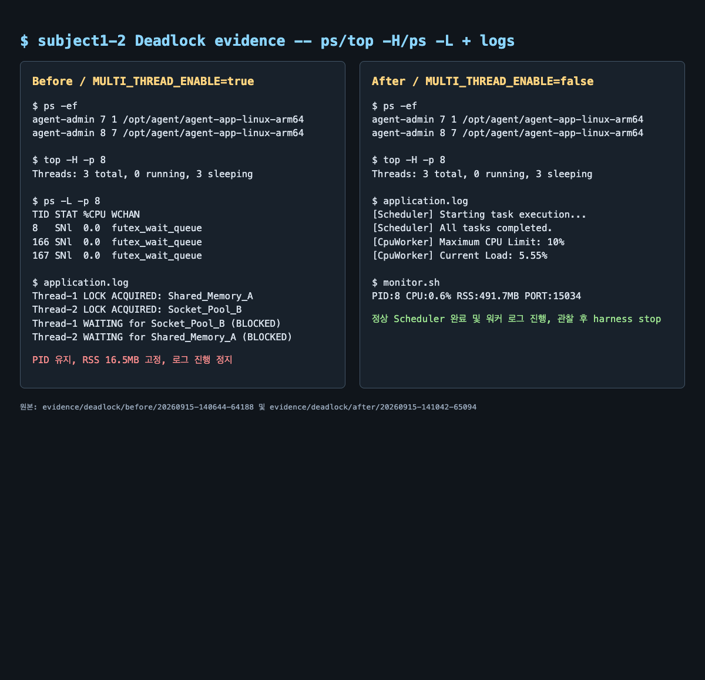

# [Bug] Deadlock - 멀티스레드 자원 순환 대기로 인한 무응답

## 1. Description (현상 설명)

`MULTI_THREAD_ENABLE=true`인 concurrent 모드에서 두 워커가 서로가 가진 자원을 기다린 뒤 더 이상 로그를 진행하지 않는 교착상태를 재현했다. 프로세스 PID는 유지되지만 워커 스레드는 계속 sleeping 상태이고, 마지막 애플리케이션 로그는 `WAITING ... BLOCKED`였다.

- Before: `MULTI_THREAD_ENABLE=true`, `MEMORY_LIMIT=512`, `CPU_MAX_OCCUPY=10`
- After: `MULTI_THREAD_ENABLE=false`, 나머지 조건 고정
- Before 관찰: 45초 설정, 실제 마지막 샘플 약 48초
- After 관찰: 30초 설정, 정상 작업과 워커 로그가 계속 진행된 뒤 harness가 컨테이너를 정리
- 두 실행 모두 Docker cgroup 한도는 1GiB이며 OOM 종료가 아니었다.

## 2. Evidence & Logs (증거 자료)

실험 원본:

- [Before metadata](../evidence/deadlock/before/20260915-140644-64188/run-metadata.txt)
- [Before application.log](../evidence/deadlock/before/20260915-140644-64188/application.log)
- [Before observations.log](../evidence/deadlock/before/20260915-140644-64188/observations.log)
- [Before container-inspect.json](../evidence/deadlock/before/20260915-140644-64188/container-inspect.json)
- [After metadata](../evidence/deadlock/after/20260915-141042-65094/run-metadata.txt)
- [After application.log](../evidence/deadlock/after/20260915-141042-65094/application.log)
- [After observations.log](../evidence/deadlock/after/20260915-141042-65094/observations.log)
- [After container-inspect.json](../evidence/deadlock/after/20260915-141042-65094/container-inspect.json)

두 실행 모두 부트 시퀀스의 6단계 [OK], `Agent READY`, 일반 사용자 `agent-admin(uid=10001)`, 포트 `15034`가 확인됐다.

### Before 로그

~~~text
2026-09-15 05:06:54,553 [INFO] [AgentWorker][Worker-Thread-1] LOCK ACQUIRED: [Shared_Memory_A]. (Holding...)
2026-09-15 05:06:54,555 [INFO] [AgentWorker][Worker-Thread-2] LOCK ACQUIRED: [Socket_Pool_B]. (Holding...)
2026-09-15 05:06:56,561 [INFO] [AgentWorker][Worker-Thread-1] WAITING for [Socket_Pool_B]... (Status: BLOCKED)
2026-09-15 05:06:56,566 [INFO] [AgentWorker][Worker-Thread-2] WAITING for [Shared_Memory_A]... (Status: BLOCKED)
~~~

마지막 두 로그 이후 Before의 `application.log`에는 새로운 작업 완료 로그가 기록되지 않았다. 그러나 `observations.log`에는 다음과 같이 프로세스가 계속 존재했다.

| 도구 | 종료 직전/관찰 마지막 값 |
| --- | --- |
| `monitor.sh` | PID 7, PID 8 유지; PID 8 RSS 16.5MB, CPU 0.0~0.5% |
| `ps -ef` | PID 7의 자식 PID 8이 계속 존재 |
| `top -H -p 8` | 3 threads, 0 running, 3 sleeping |
| `ps -L -p 8` | TID 8/166/167 모두 `futex_wait_queue` |
| `docker stats` | CPU 0.01%, 메모리 약 9.9MiB / 1GiB |

Before 마지막 샘플의 PID 8 RSS는 시작 시 16.4MB, ETIME 00:16부터 마지막 ETIME 01:21까지 16.5MB로 사실상 변하지 않았다.

### After 로그

~~~text
2026-09-15 05:10:47,057 [INFO] [Scheduler] Starting task execution...
2026-09-15 05:10:48,184 [INFO] [Scheduler] All tasks completed.
2026-09-15 05:10:48,194 [INFO] [CpuWorker] Started. Maximum CPU Limit: 10%
2026-09-15 05:11:37,192 [INFO] [CpuWorker] Peak reached (10.00%). Starting cooldown...
2026-09-15 05:11:44,429 [INFO] [CpuWorker] Current Load: 5.55%
~~~

After에는 `WAITING ... BLOCKED` 로그가 없었고, Scheduler 완료 후 `MemoryWorker`와 `CpuWorker` 로그가 계속 추가됐다. 마지막 관측에서도 PID 8은 RSS 491.7MB, CPU 0.6%로 존재했으며, 정상 실행을 구분하기 위해 앱 로그 진행 여부를 함께 확인했다.

## 3. Root Cause Analysis (원인 분석)

로그로 확인되는 교착 순서는 다음과 같다.

1. Worker-Thread-1이 `Shared_Memory_A`를 획득한 채 유지한다.
2. Worker-Thread-2가 `Socket_Pool_B`를 획득한 채 유지한다.
3. Thread-1은 B를 기다리고, Thread-2는 A를 기다린다.
4. 어느 스레드도 자신이 가진 락을 반납하고 다음 단계로 갈 수 없다.

이는 상호 배제, 점유 대기, 비선점, 순환 대기의 네 조건을 모두 만족하는 전형적인 circular wait다. Linux 관점에서는 프로세스가 죽은 것이 아니라 스레드가 락/동기화 대기에서 sleeping 상태로 남을 수 있으므로, PID 존재만으로 정상이라고 판단하면 안 된다. `futex_wait_queue`와 0%에 가까운 CPU, 로그 정지가 함께 이 추론을 뒷받침한다.

## 4. Workaround & Verification (조치 및 검증)

### 조치 내용

`MULTI_THREAD_ENABLE`을 `true`에서 `false`로 바꿔 concurrent lock path를 회피했다. 이는 교착을 회피하는 우회책이다. 근본 해결은 공유 자원 락 순서를 통일하거나 timeout/try-lock으로 대기 상한을 두는 것이다.

### Before & After

| 항목 | Before: true | After: false |
| --- | --- | --- |
| 프로세스 | PID 7/8이 45초 이상 유지 | PID 7/8이 관찰 중 유지, harness 종료로 정리 |
| 스레드 상태 | 3 threads, 0 running/3 sleeping, `futex_wait_queue` | Scheduler 정상 완료, 워커 로그 계속 진행 |
| RSS/CPU | PID 8 RSS 16.5MB 고정, CPU 0.0~0.5% | PID 8 RSS 16.4 -> 491.7MB, CPU 약 0.6%; 작업 진행 중 |
| 마지막/핵심 로그 | 두 워커의 `WAITING ... BLOCKED` | `All tasks completed`, `Current Load` 지속 |
| 컨테이너 종료 | 증거 수집 뒤 stop, `ExitCode=143` | 증거 수집 뒤 stop, `ExitCode=143` |

Before와 After 모두 관찰 후 컨테이너를 정리했으므로 종료 코드 자체를 정상/비정상의 판정 기준으로 사용하지 않았다. 판정 기준은 Before의 로그 정지·futex 대기와 After의 Scheduler/워커 로그 진행이다.

### 근본 해결 제안

모든 코드 경로에서 `Shared_Memory_A -> Socket_Pool_B`처럼 전역 락 획득 순서를 하나로 통일한다. 추가로 락 획득 timeout, `try_lock`, 대기 중인 자원/소유자 로깅, 교착 감지 후 작업 취소를 적용하고 멀티스레드 모드에서 동일한 실험을 반복한다.
