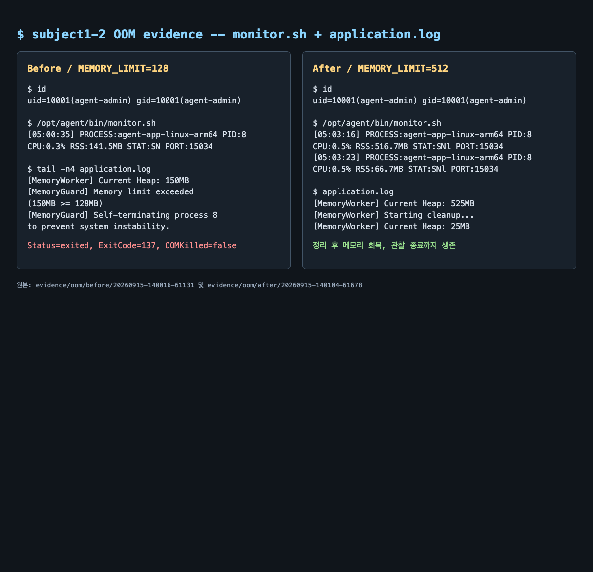

# [Bug] OOM - MemoryGuard 임계치 초과에 따른 프로세스 종료

## 1. Description (현상 설명)

`agent-leak-app`의 작업 워커(PID 8)가 힙을 25MB 단위로 계속 늘리다가 낮은 `MEMORY_LIMIT`에서 종료되는 현상을 재현했다. `monitor.sh`는 시스템 전체 메모리가 아니라 대상 프로세스의 RSS를 기록했다.

- Before: `MEMORY_LIMIT=128`, `CPU_MAX_OCCUPY=10`, `MULTI_THREAD_ENABLE=false`
- After: `MEMORY_LIMIT=512`, 나머지 조건 고정
- Docker 보조 한도: `mem_limit=1g`. 두 실행 모두 `OOMKilled=false`였다.
- 결과: Before는 약 17초 후 앱의 `MemoryGuard`가 워커를 자기 종료했고, After는 525MB 도달 후 캐시 정리와 메모리 회복을 거쳐 관찰 시간 동안 계속 실행됐다.

## 2. Evidence & Logs (증거 자료)

실험 원본:

- [Before metadata](../evidence/oom/before/20260915-140016-61131/run-metadata.txt)
- [Before application.log](../evidence/oom/before/20260915-140016-61131/application.log)
- [Before observations.log](../evidence/oom/before/20260915-140016-61131/observations.log)
- [Before container-inspect.json](../evidence/oom/before/20260915-140016-61131/container-inspect.json)
- [After metadata](../evidence/oom/after/20260915-140104-61678/run-metadata.txt)
- [After application.log](../evidence/oom/after/20260915-140104-61678/application.log)
- [After observations.log](../evidence/oom/after/20260915-140104-61678/observations.log)
- [After container-inspect.json](../evidence/oom/after/20260915-140104-61678/container-inspect.json)

두 실행 모두 부트 로그에 6단계 [OK], `Agent READY`, `agent-admin(uid=10001)`, `0.0.0.0:15034` 바인딩 성공이 기록됐다.

### 프로세스 RSS 관측

`observations.log`의 PID 8(자식 워커) 샘플은 다음과 같다.

| 실행 | 관측 시점 | 앱 Heap 로그와 가까운 RSS 샘플 | monitor 상태 |
| --- | ---: | ---: | --- |
| Before | 시작 | 16.4MB | `STAT:SN` |
| Before | ETIME 00:05 | 66.5MB | `CPU:0.8%` |
| Before | ETIME 00:10 | 91.5MB | `CPU:0.5%` |
| Before | ETIME 00:16 | 141.5MB | 종료 직전 상승 |
| After | 시작 | 16.4MB | `STAT:SN` |
| After | ETIME 01:25 | 166.7MB | 계속 실행 |
| After | ETIME 02:08 | 516.7MB | `CPU:0.5%` |
| After | ETIME 02:15 | 66.7MB | 정리 후 다시 감소 |

Before 애플리케이션 로그의 종료 직전 구간:

~~~text
2026-09-15 05:00:33,676 [INFO] [MemoryWorker] Current Heap: 125MB
2026-09-15 05:00:36,679 [INFO] [MemoryWorker] Current Heap: 150MB
2026-09-15 05:00:36,679 [CRITICAL] [MemoryGuard] Memory limit exceeded (150MB >= 128MB) / (Recommend Over 256MB)
2026-09-15 05:00:36,679 [CRITICAL] [MemoryGuard] Self-terminating process 8 to prevent system instability.
~~~

Before 컨테이너 상태는 `Status=exited`, `ExitCode=137`, `OOMKilled=false`, cgroup 메모리 한도 1,073,741,824 bytes였다. 즉 Docker가 메모리 부족으로 kill한 증거가 아니라 앱 로그와 `MemoryGuard`의 종료가 함께 확인된다.

After의 회복 구간:

~~~text
2026-09-15 05:02:07,964 [INFO] [MemoryWorker] Current Heap: 500MB
2026-09-15 05:02:10,990 [INFO] [MemoryWorker] Current Heap: 525MB
2026-09-15 05:02:10,991 [WARNING] [MemoryWorker] Memory Usage Reached Limit (525MB). Starting cleanup...
2026-09-15 05:02:16,021 [INFO] [MemoryWorker] Current Heap: 25MB
~~~

After는 관찰 한도 90초로 실행했고 최종 샘플까지 프로세스가 살아 있었다. 종료 시 `ExitCode=143`였지만 이는 관찰 종료를 위해 실행 스크립트가 컨테이너를 stop한 결과이며, `OOMKilled=false`이다.

## 3. Root Cause Analysis (원인 분석)

관측 가능한 원인은 `MemoryWorker`가 작업 중 확보한 힙을 25MB 간격으로 누적시키고, `MEMORY_LIMIT`과 비교하는 보호 정책이다.

- Before에서는 힙이 125MB에서 150MB로 증가한 직후 `150MB >= 128MB` 조건을 만족했다.
- `MemoryGuard`는 OS의 자연스러운 회수나 Docker cgroup 종료를 기다리지 않고 프로세스 8을 자기 종료했다.
- After에서는 512MB 설정에서도 힙이 525MB까지 올라가지만, `MemoryWorker`가 `Starting cleanup`을 기록하고 25MB로 회복했다.

소스 코드 없이 바이너리를 분석하지 않는 범위에서는 영구적인 메모리 누수라고 단정하기보다, 메모리 확보량에 충분한 상한·정리 주기가 없을 때 `MemoryGuard`를 호출하는 자원 고갈 경로가 확인됐다고 결론 내린다. 근본 결함 여부는 소스의 자료구조 수명과 해제 시점을 별도로 점검해야 한다.

## 4. Workaround & Verification (조치 및 검증)

### 조치 내용

`MEMORY_LIMIT`을 128MB에서 512MB로 높였다. Docker cgroup은 1GiB로 유지해 앱의 내부 임계치 동작을 관찰할 수 있게 했다. 이 변경은 누적 할당 자체를 제거하는 근본 해결이 아니라, 정리 루틴이 실행될 시간을 확보하는 우회책이다.

### Before & After

| 항목 | Before | After |
| --- | ---: | ---: |
| `MEMORY_LIMIT` | 128MB | 512MB |
| PID 8 RSS | 16.4 -> 141.5MB, 약 16초 | 16.4 -> 516.7MB 후 66.7MB |
| 앱 Heap 결과 | 150MB에서 `MemoryGuard` 자기 종료 | 525MB에서 cleanup, 25MB로 회복 |
| 생존/종료 | 약 17초, `ExitCode=137` | 약 2분 15초 관찰 후 harness 종료, `OOMKilled=false` |
| Docker cgroup | 1GiB, `OOMKilled=false` | 1GiB, `OOMKilled=false` |

### 근본 해결 제안

할당하는 버퍼·캐시·작업 큐의 최대 크기를 제한하고, 작업 단위가 끝날 때 참조를 해제한다. 주기적인 cleanup을 임계치 도달 직전이 아니라 여유 구간에서 실행하고, RSS/heap과 cleanup 횟수를 지표로 남긴 뒤 동일한 `monitor.sh` 조건에서 메모리가 안정화되는지 검증한다.
