# Mini Git 학습 노트

## 이 과제의 목표

이 과제의 목표는 **실제 Git과 똑같은 버전 관리 프로그램을 만드는 것**이 아니다. Git의 커밋과 브랜치가 서로 연결되는 모습을 간단한 모델로 구현하면서, 그 안에 사용되는 자료구조와 알고리즘을 직접 학습하는 것이 핵심이다.

실제 Git은 파일 변경을 감지하고, staging area를 관리하며, 파일 내용을 객체로 저장한다. 이번 Mini Git은 이런 기능을 구현하지 않는다. 파일 대신 커밋의 메타데이터와 연결 관계만 메모리에 저장한다.

```text
실제 Git 전체를 구현한다                 X
Git의 개념을 학습용 자료구조로 표현한다   O
```

Git의 개념은 다음 자료구조와 알고리즘을 공부하기 위한 소재가 된다.

| Git에서 가져온 개념 | 이 과제에서 학습하는 내용 |
| --- | --- |
| 커밋과 부모 커밋 | 노드와 간선, 방향 그래프, DAG |
| 커밋 hash | 해시맵을 이용한 빠른 조회 |
| 브랜치와 HEAD | 특정 커밋을 가리키는 포인터 |
| 커밋 로그 | 부모 우선 위상 정렬 |
| 커밋 사이의 경로 | BFS를 이용한 최단 경로 탐색 |
| 커밋의 모든 조상 | DFS 또는 스택을 이용한 그래프 탐색 |
| 날짜·작성자 로그 | 직접 구현한 병합 정렬 |
| 메시지·작성자 검색 | 역색인과 posting list |

따라서 이 과제에서는 다음 질문에 답할 수 있어야 한다.

- 커밋들이 연결되면 왜 그래프가 되는가?
- Git의 커밋 그래프가 왜 DAG인가?
- 브랜치는 왜 커밋의 복사본이 아니라 포인터인가?
- 부모를 자식보다 먼저 출력하려면 어떤 알고리즘이 필요한가?
- 두 커밋 사이의 최단 경로와 모든 조상은 어떻게 찾는가?
- 정렬 API 없이 커밋을 어떻게 정렬하는가?
- 역색인은 왜 전체 커밋을 순회하는 검색보다 빠른가?

> 한 문장으로 정리하면, 이 과제는 **Git을 만드는 과제라기보다 Git의 커밋 구조를 예제로 그래프, 탐색, 정렬, 해시맵, 역색인을 배우는 과제**다.

## 1. 가장 작은 예제로 커밋과 브랜치 이해하기

이 과제의 Mini Git은 실제 파일 변경 내용을 저장하지 않는다. 대신 다음과 같은 **커밋 정보와 커밋 사이의 관계**를 메모리에 기록한다.

- 커밋 hash
- 커밋 메시지
- 작성자
- 생성 시각
- 부모 커밋

이번 장에서는 `main`과 `feature` 브랜치만 사용해 다음 질문에 답해 본다.

1. 커밋을 만들면 무엇이 생기는가?
2. 브랜치를 만들면 무엇이 복사되는가?
3. 브랜치를 전환하면 무엇이 바뀌는가?
4. 서로 다른 브랜치에서 커밋하면 그래프가 어떻게 갈라지는가?

### 1.1 저장소 초기화

Mini Git을 실행하고 저장소를 초기화한다.

```text
mini-git> INIT Steven
Initialized repository.
Current branch: main
Current user: Steven
```

초기화하면 다음 상태가 만들어진다.

```text
현재 사용자: Steven
현재 브랜치: main
main의 HEAD: 아직 없음
```

아직 커밋하지 않았으므로 커밋 그래프는 비어 있다. `HEAD`는 현재 선택한 브랜치인 `main`을 가리킨다.


> 이 과제에서는 실제 Git의 HEAD 구조를 단순화해 현재 브랜치 이름을 `current_branch`에 저장한다.

### 1.2 첫 번째 커밋 만들기

```text
mini-git> COMMIT "Initial commit"
[main c000001] Initial commit
```

`COMMIT`을 실행하면 다음 정보를 가진 커밋 노드가 만들어진다.

```text
hash: c000001
message: Initial commit
author: Steven
timestamp: 커밋을 실행한 시각
parents: 없음
```

최초 커밋은 앞선 커밋이 없으므로 부모가 없다. 커밋을 만든 후 `main` 브랜치는 새 커밋 `c000001`을 가리킨다.

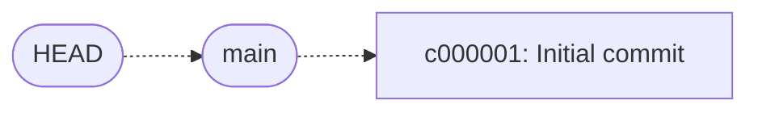

내부 상태를 단순하게 표현하면 다음과 같다.

```python
branches = {
    "main": "c000001",
}

current_branch = "main"
```

여기서 기억해야 할 점은 다음과 같다.

> 커밋하면 새 커밋 노드가 생기고, 현재 브랜치가 그 노드를 가리키도록 이동한다.

### 1.3 feature 브랜치 만들기

현재 위치에서 `feature` 브랜치를 만든다.

```text
mini-git> BRANCH feature
Created branch: feature
```

브랜치를 만들어도 새로운 커밋은 생기지 않는다. 현재 `main`이 가리키던 `c000001`을 `feature`도 함께 가리키게 된다.

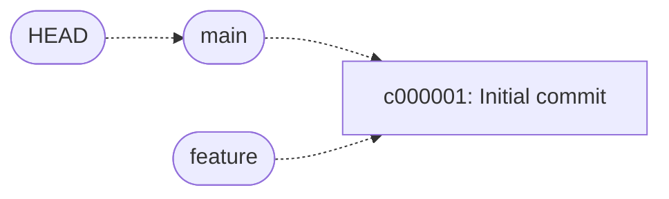

내부 브랜치 정보는 다음과 같다.

```python
branches = {
    "main": "c000001",
    "feature": "c000001",
}

current_branch = "main"
```

두 브랜치는 서로 다른 커밋 복사본을 가진 것이 아니다. 동일한 `c000001`을 가리키는 포인터 두 개가 존재하는 것이다.

> 브랜치를 만든다는 것은 커밋을 복사하는 것이 아니라, 현재 커밋을 가리키는 새로운 포인터를 추가하는 것이다.

### 1.4 feature 브랜치로 전환하기

```text
mini-git> SWITCH feature
Switched to branch: feature
```

`SWITCH`를 실행해도 커밋 그래프와 브랜치의 위치는 바뀌지 않는다. 현재 선택한 브랜치만 `main`에서 `feature`로 변경된다.

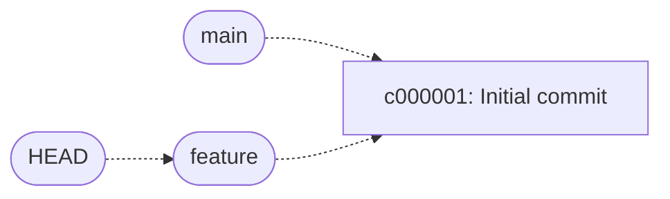

```python
branches = {
    "main": "c000001",
    "feature": "c000001",
}

current_branch = "feature"
```

변경된 것은 `current_branch`뿐이다.

### 1.5 feature에서 커밋하기

현재 브랜치는 `feature`다. 이 상태에서 새 커밋을 만든다.

```text
mini-git> COMMIT "Add login feature"
[feature c000002] Add login feature
```

새 커밋 `c000002`는 현재 `feature`가 가리키던 `c000001`을 부모로 가진다. 그다음 `feature`가 `c000002`로 이동한다.

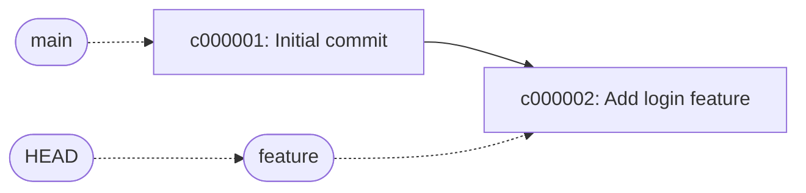

브랜치 상태는 다음과 같다.

```python
branches = {
    "main": "c000001",
    "feature": "c000002",
}

current_branch = "feature"
```

`main`은 움직이지 않고 `feature`만 새 커밋으로 이동했다.

### 1.6 main에서도 커밋해 분기 만들기

다시 `main`으로 전환한다.

```text
mini-git> SWITCH main
Switched to branch: main
```

`main`은 아직 `c000001`을 가리키고 있다. 여기서 새로운 커밋을 만든다.

```text
mini-git> COMMIT "Update home page"
[main c000003] Update home page
```

`c000003`의 부모는 `main`이 가리키던 `c000001`이다. 이제 두 브랜치가 `c000001`에서 갈라진다.

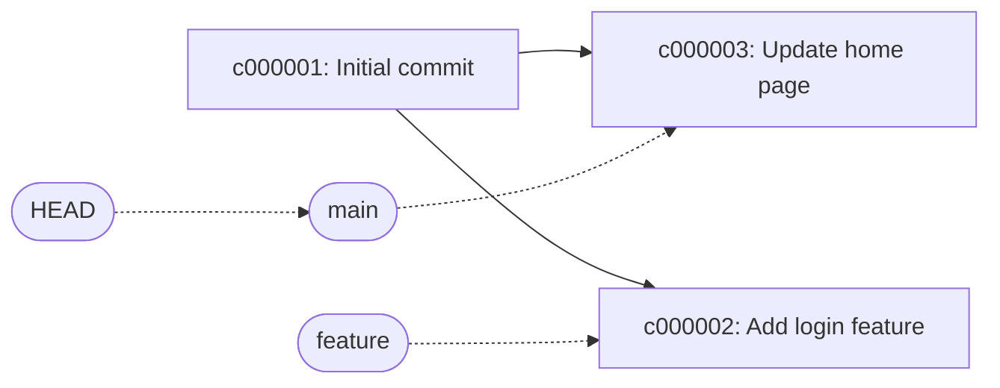

최종 내부 상태는 다음과 같다.

```python
branches = {
    "main": "c000003",
    "feature": "c000002",
}

current_branch = "main"
```

각 브랜치의 커밋 이력은 다음과 같다.

| 브랜치 | 현재 HEAD | 부모를 따라간 커밋 이력 |
| --- | --- | --- |
| `main` | `c000003` | `c000001 → c000003` |
| `feature` | `c000002` | `c000001 → c000002` |

`c000001`은 두 브랜치가 함께 사용하는 공통 조상이다.

### 1.7 만들어진 그래프 확인하기

#### LOG

```text
mini-git> LOG
```

`LOG`는 저장소의 모든 커밋을 부모가 자식보다 먼저 나오도록 출력한다. 따라서 `c000001`은 `c000002`와 `c000003`보다 먼저 출력된다.

```text
c000001: Initial commit
c000002: Add login feature
c000003: Update home page
```

#### PATH

```text
mini-git> PATH c000002 c000003
Path: c000002 -> c000001 -> c000003
```

`feature`의 커밋에서 `main`의 커밋으로 이동하려면 두 브랜치의 공통 조상인 `c000001`을 지나야 한다.

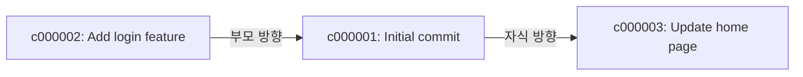

#### ANCESTORS

```text
mini-git> ANCESTORS c000002
```

`c000002`의 부모를 따라가면 `c000001`에 도달한다. 따라서 `c000002`의 조상은 `c000001` 하나다.

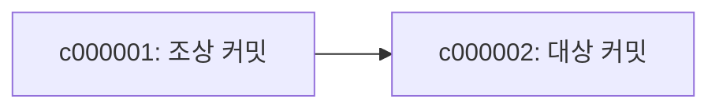

### 1.8 전체 명령 다시 보기

다음 명령을 순서대로 실행하면 이번 장의 예시를 그대로 재현할 수 있다.

```text
INIT Steven
COMMIT "Initial commit"
BRANCH feature
SWITCH feature
COMMIT "Add login feature"
SWITCH main
COMMIT "Update home page"
LOG
PATH c000002 c000003
ANCESTORS c000002
```

이번 예시에서 반드시 기억해야 할 내용은 다섯 가지다.

1. 커밋은 부모 커밋 hash를 가진 기록이다.
2. 브랜치는 특정 커밋을 가리키는 포인터다.
3. `SWITCH`는 현재 선택한 브랜치만 변경한다.
4. `COMMIT`은 새 노드를 만들고 현재 브랜치를 그 노드로 이동시킨다.
5. 서로 다른 브랜치에서 커밋하면 공통 커밋을 기준으로 그래프가 갈라진다.

다음 장에서는 방금 만든 커밋 관계를 왜 그래프라고 부르는지, 그리고 그래프 알고리즘이 왜 필요한지 살펴본다.

## 2. 커밋 이력을 왜 그래프로 표현할까?

1장에서는 명령을 실행하면서 커밋과 브랜치가 어떻게 움직이는지 확인했다. 이번 장에서는 그 결과를 자료구조의 관점에서 해석한다.

이번 장의 목표는 다음과 같다.

1. 그래프의 노드와 간선이 무엇인지 이해한다.
2. 방향 그래프와 무방향 그래프의 차이를 이해한다.
3. DAG가 무엇이며 커밋 이력이 왜 DAG인지 설명한다.
4. 트리와 DAG의 차이를 이해한다.
5. 커밋 그래프를 코드에서 어떻게 저장하는지 이해한다.
6. `LOG`, `PATH`, `ANCESTORS`에 서로 다른 알고리즘이 필요한 이유를 이해한다.

### 2.1 그래프란 무엇인가?

그래프는 여러 대상을 **노드**로 표현하고, 대상 사이의 관계를 **간선**으로 표현하는 자료구조다.

```text
그래프 = 노드의 집합 + 노드 사이를 연결하는 간선의 집합
```

지도에서는 도시가 노드이고 도로가 간선이다. 소셜 네트워크에서는 사람이 노드이고 친구 관계가 간선이다. Mini Git에서는 커밋이 노드이고 부모·자식 관계가 간선이다.

| 그래프 용어 | Mini Git에서 의미하는 것 |
| --- | --- |
| 노드 | 커밋 하나 |
| 간선 | 부모 커밋과 자식 커밋의 연결 |
| 경로 | 간선을 따라 이동한 커밋의 순서 |
| 인접 노드 | 부모 또는 자식으로 직접 연결된 커밋 |

1장에서 만든 최종 커밋 관계를 다시 보자.

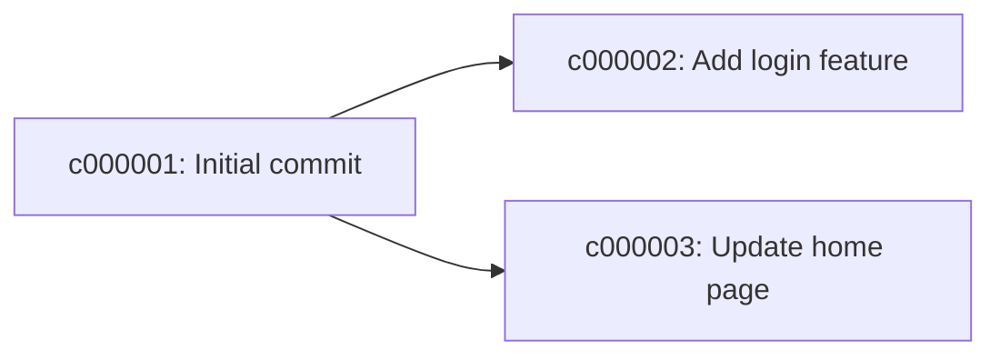

이 그래프에는 노드 3개와 간선 2개가 있다.

```text
노드 V = {c000001, c000002, c000003}

간선 E = {
    c000001 → c000002,
    c000001 → c000003
}
```

그래프에서 노드 개수는 보통 `V`, 간선 개수는 `E`로 표현한다. 이후 알고리즘의 시간복잡도에 등장하는 `O(V + E)`는 모든 커밋과 모든 연결을 한 번씩 확인한다는 의미다.

### 2.2 단순한 리스트로는 부족한 이유

브랜치가 없다면 커밋 이력은 한 줄로 이어진다.

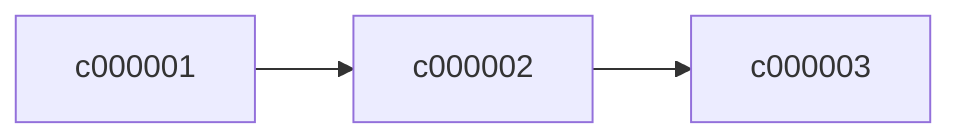

이런 구조는 연결 리스트처럼 생각할 수 있다. 각 커밋이 이전 커밋 하나만 기억하면 이력을 따라갈 수 있기 때문이다.

하지만 브랜치가 생기면 하나의 커밋에서 여러 작업이 갈라질 수 있다.

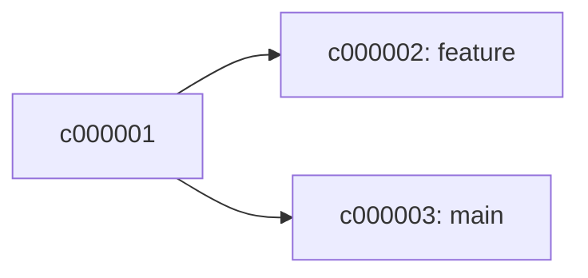

`c000001`의 다음 커밋이 하나로 결정되지 않는다. `feature`에서는 `c000002`로, `main`에서는 `c000003`으로 이어진다. 따라서 커밋 전체의 관계를 한 줄짜리 리스트로 표현할 수 없다.

이처럼 하나의 대상에서 여러 갈래로 관계가 이어질 수 있으므로 그래프가 필요하다.

> 브랜치 이름 때문에 그래프가 되는 것이 아니다. 커밋 하나가 여러 자식 커밋과 연결될 수 있기 때문에 그래프가 된다.

### 2.3 방향 그래프란 무엇인가?

커밋의 연결에는 시간과 의존 관계에 따른 방향이 있다.

```text
부모 커밋 → 자식 커밋
```

`c000002`는 `c000001` 이후에 만들어졌고, `c000001`을 부모로 가진다.

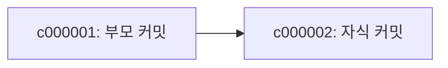

이 문서의 그림에서는 시간의 흐름을 쉽게 볼 수 있도록 부모에서 자식 방향으로 화살표를 그린다.

그러나 실제 `Commit` 객체는 반대쪽 정보를 저장한다. 자식 커밋이 부모 hash를 기억한다.

```python
Commit(
    hash="c000002",
    message="Add login feature",
    author="Steven",
    timestamp=...,
    parents=("c000001",),
    sequence=2,
)
```

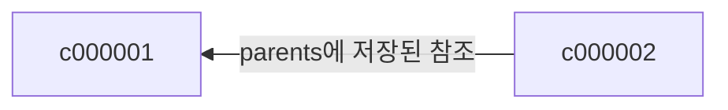

두 그림은 서로 다른 관계를 설명하는 것이 아니다. 동일한 부모·자식 관계를 바라보는 방향만 다르다.

| 표현 목적 | 화살표 방향 |
| --- | --- |
| 시간 흐름과 로그 설명 | 부모 → 자식 |
| `parents` 필드의 실제 참조 | 자식 → 부모 |

방향이 있는 간선으로 구성된 그래프를 **방향 그래프**라고 한다.

### 2.4 DAG란 무엇인가?

DAG는 `Directed Acyclic Graph`의 약자다.

| 단어 | 의미 |
| --- | --- |
| Directed | 간선에 방향이 있다. |
| Acyclic | 어느 노드에서 출발해도 자기 자신으로 돌아오는 순환이 없다. |
| Graph | 노드와 간선으로 관계를 표현한다. |

정상적인 커밋 그래프는 다음처럼 과거에서 미래로 진행된다.

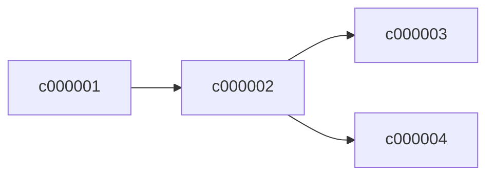

새 커밋은 이미 존재하는 커밋을 부모로 삼는다. 아직 만들어지지 않은 미래 커밋을 부모로 지정할 수 없기 때문에 과거에서 출발해 자기 자신으로 돌아오는 경로가 생기지 않는다.

반대로 다음 구조에는 순환이 있다.

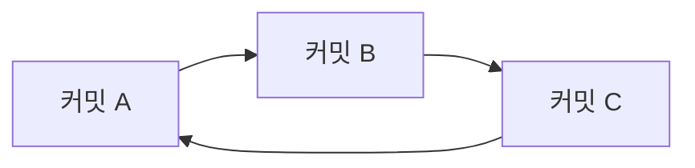

이 구조에서는 `A`의 과거를 따라가다 다시 `A`로 돌아오게 된다. 그러면 다음 문제가 발생한다.

- 무엇이 먼저 만들어진 커밋인지 결정할 수 없다.
- 부모를 먼저 출력하는 위상 정렬을 완료할 수 없다.
- 조상을 탐색할 때 방문 처리가 없으면 무한히 반복할 수 있다.
- 커밋 이력의 시간적 의미가 깨진다.

Mini Git의 `COMMIT`은 항상 현재 HEAD를 새 커밋의 부모로 사용한다.

```text
기존 HEAD → 새 커밋 생성 → 브랜치 HEAD 이동
```

따라서 새 커밋에서 과거 커밋으로 이어지는 관계만 만들어지고 DAG가 유지된다.

### 2.5 트리와 DAG는 무엇이 다를까?

트리도 그래프의 한 종류다. 트리에서는 루트를 제외한 각 노드가 부모를 정확히 하나만 가진다.

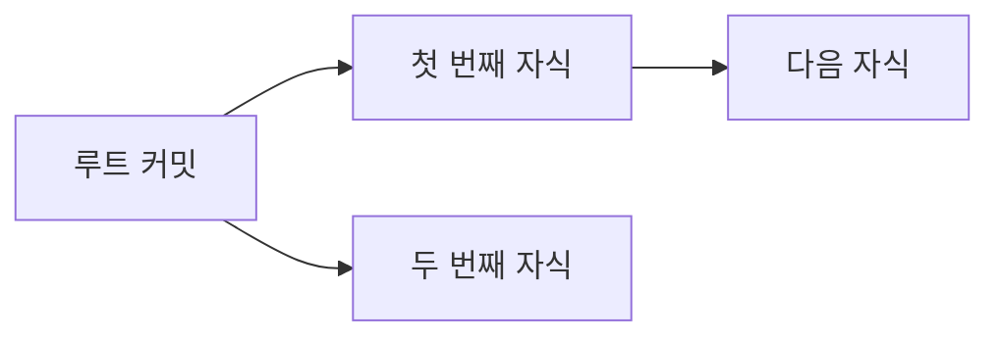

현재 필수 명령의 일반 커밋은 부모가 없거나 하나다. `MERGE` 보너스를 구현하지 않았기 때문에 실제 실행으로 만들어지는 연결은 대부분 트리 또는 여러 트리로 이루어진 포리스트 형태다.

하지만 과제의 커밋 모델은 여러 부모를 저장할 수 있다.

```python
parents: Tuple[str, ...]
```

실제 Git의 merge commit은 부모를 둘 이상 가질 수 있다. 다음은 개념을 설명하기 위한 그림이며, 이번 과제에서 `MERGE` 명령은 구현하지 않았다.

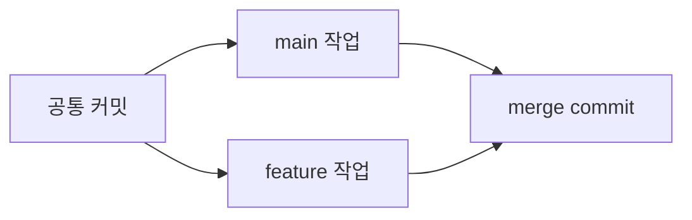

`merge commit`은 `main 작업`과 `feature 작업`이라는 부모를 두 개 가진다. 부모가 여러 개가 될 수 있으므로 일반적인 트리 조건에서 벗어나지만, 순환은 없으므로 여전히 DAG다.

정리하면 다음과 같다.

| 구조 | 부모 개수 | 분기 | 다시 합쳐짐 | 순환 |
| --- | ---: | --- | --- | --- |
| 연결 리스트 형태 | 최대 1개 | 불가능 | 불가능 | 없음 |
| 트리 | 최대 1개 | 가능 | 불가능 | 없음 |
| 커밋 DAG | 여러 개 가능 | 가능 | 가능 | 없음 |

### 2.6 그래프를 코드에서는 어떻게 저장할까?

Mini Git은 그래프 전용 라이브러리를 사용하지 않고 `dict`, `list`, `tuple` 같은 기본 자료형으로 그래프를 표현한다.

#### 커밋 저장소

```python
commits = {
    "c000001": Commit(...),
    "c000002": Commit(...),
    "c000003": Commit(...),
}
```

커밋 hash를 key로 사용하기 때문에 특정 커밋을 평균 `O(1)`에 찾을 수 있다.

#### 부모 방향 연결

각 커밋은 자신의 부모 hash를 가진다.

```python
commits["c000002"].parents == ("c000001",)
commits["c000003"].parents == ("c000001",)
```

이 정보는 다음 작업에 유용하다.

- 특정 커밋의 부모 확인
- `ANCESTORS`에서 조상 방향으로 이동
- 새 커밋과 기존 HEAD 연결

#### 자식 방향 연결

부모에서 자식으로 빠르게 이동할 수 있도록 별도의 `children` 딕셔너리도 관리한다.

```python
children = {
    "c000001": ["c000002", "c000003"],
    "c000002": [],
    "c000003": [],
}
```

이 정보는 다음 작업에 유용하다.

- `LOG`에서 부모를 출력한 후 자식 처리
- `PATH`에서 부모와 자식 양쪽으로 이동

이 저장 방식은 인접 리스트와 비슷하다. 모든 커밋 쌍의 연결 여부를 표로 저장하는 대신, 실제로 연결된 커밋만 목록에 보관한다.

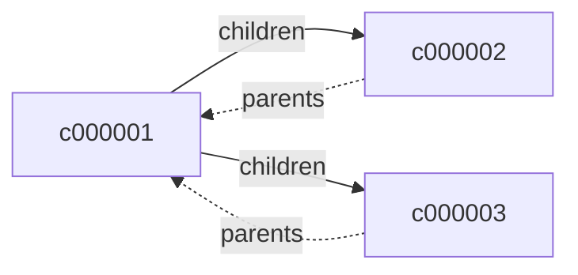

#### 브랜치는 그래프의 간선이 아니다

브랜치는 커밋 사이의 연결이 아니라 특정 커밋을 가리키는 이름표다.

```python
branches = {
    "main": "c000003",
    "feature": "c000002",
}
```

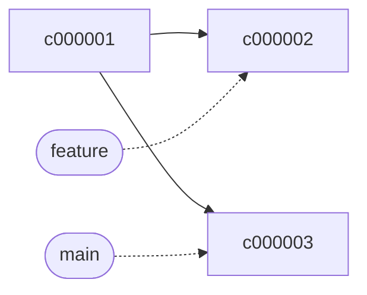

실선은 커밋 그래프의 간선이고 점선은 브랜치 포인터다. 브랜치 포인터는 커밋 그래프의 부모·자식 관계에 포함되지 않는다.

### 2.7 왜 서로 다른 그래프 알고리즘이 필요할까?

같은 커밋 그래프를 사용하더라도 명령마다 묻는 질문이 다르다.

| 명령 | 그래프에 묻는 질문 | 사용하는 방법 | 필요한 이유 |
| --- | --- | --- | --- |
| `LOG` | 부모를 자식보다 먼저 어떻게 출력할까? | 위상 정렬 | 단순 정렬은 부모 관계를 보장하지 못한다. |
| `PATH` | 두 커밋 사이의 가장 짧은 연결은 무엇일까? | BFS | 가중치 없는 그래프의 최단 경로를 찾는다. |
| `ANCESTORS` | 이 커밋의 모든 과거 커밋은 무엇일까? | 스택 기반 탐색 | 부모 방향으로 도달 가능한 노드를 모두 방문한다. |

#### LOG가 단순한 최신순 정렬이 아닌 이유

분기된 그래프에서는 작성 시각이나 hash만 정렬해서 부모 관계를 완전히 표현할 수 있다고 가정해서는 안 된다. `LOG`의 요구사항은 부모가 자식보다 먼저 나오는 것이다. 이런 선후 관계를 만족하는 순서를 구하는 알고리즘이 위상 정렬이다.

#### PATH가 부모 방향만 보면 안 되는 이유

서로 다른 브랜치의 커밋 사이를 이동하려면 먼저 부모 방향으로 공통 조상까지 이동한 다음, 다른 브랜치의 자식 방향으로 이동해야 한다.

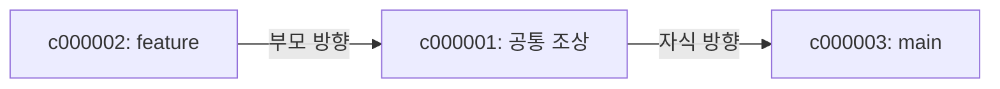

따라서 `PATH`에서는 부모 연결을 무방향 간선처럼 취급하고 BFS를 사용한다.

#### ANCESTORS가 자식 방향을 볼 필요가 없는 이유

조상은 대상 커밋보다 먼저 존재한 커밋이다. 따라서 `parents`를 따라 부모 방향으로만 이동하면 된다. 스택에 부모를 넣고 방문할 커밋이 없을 때까지 반복한다.

### 2.8 이번 장에서 기억할 내용

1. 커밋은 노드이고 부모·자식 관계는 간선이다.
2. 브랜치가 생기면 커밋 이력은 한 줄이 아니라 여러 갈래로 나뉜다.
3. 커밋 간선에는 부모와 자식이라는 방향이 있다.
4. 커밋 그래프는 방향이 있고 순환이 없는 DAG다.
5. 현재 필수 구현은 트리와 비슷하지만, 여러 부모를 허용하는 전체 커밋 모델은 DAG다.
6. `commits`, `parents`, `children`을 이용해 인접 리스트 형태로 그래프를 저장한다.
7. 브랜치는 그래프의 간선이 아니라 커밋을 가리키는 포인터다.
8. `LOG`, `PATH`, `ANCESTORS`는 서로 다른 질문에 답하므로 서로 다른 그래프 알고리즘을 사용한다.

스스로 다음 질문에 답해 보자.

- 브랜치가 없을 때 커밋 이력을 리스트처럼 볼 수 있는 이유는 무엇인가?
- 브랜치가 생기면 왜 그래프가 필요한가?
- DAG에서 순환이 없어야 하는 이유는 무엇인가?
- 코드가 `parents`와 `children`을 모두 저장하는 이유는 무엇인가?
- 브랜치 포인터가 그래프 간선이 아닌 이유는 무엇인가?
- `PATH`가 부모와 자식을 모두 이웃으로 취급하는 이유는 무엇인가?

다음 장부터는 위상 정렬, BFS, 조상 탐색을 각각 분리해 실제 동작 과정과 시간복잡도를 자세히 살펴본다.

## 3. LOG와 위상 정렬

`LOG` 명령은 저장소의 모든 커밋을 보여준다. 이번 과제에서 중요한 점은 단순히 커밋을 저장된 순서나 최신순으로 출력하는 것이 아니라, **부모 커밋이 항상 자식 커밋보다 먼저 나오게 출력해야 한다는 것**이다.

이번 장의 목표는 다음과 같다.

1. 부모 우선 출력이 무엇인지 이해한다.
2. 위상 정렬이 어떤 문제를 해결하는지 이해한다.
3. 진입 차수의 의미를 이해한다.
4. Kahn 알고리즘의 동작을 단계별로 따라간다.
5. 위상 정렬 결과가 여러 개일 수 있는 이유를 이해한다.
6. 현재 구현이 결과 순서를 일정하게 만드는 방법을 이해한다.
7. 현재 구현의 실제 시간복잡도를 설명한다.

### 3.1 LOG가 지켜야 하는 규칙

다음과 같은 커밋 그래프가 있다고 가정하자.

```mermaid
flowchart LR
    rootCommit["c000001: Initial commit"]
    mainWork["c000002: Main work"]
    featureWork["c000003: Feature work"]
    mainFix["c000004: Main fix"]
    featureFix["c000005: Feature fix"]

    rootCommit --> mainWork
    rootCommit --> featureWork
    mainWork --> mainFix
    featureWork --> featureFix
```

부모 관계는 다음과 같다.

| 자식 커밋 | 부모 커밋 |
| --- | --- |
| `c000001` | 없음 |
| `c000002` | `c000001` |
| `c000003` | `c000001` |
| `c000004` | `c000002` |
| `c000005` | `c000003` |

`LOG` 출력은 최소한 다음 선후 관계를 지켜야 한다.

```text
c000001은 c000002보다 먼저
c000001은 c000003보다 먼저
c000002는 c000004보다 먼저
c000003은 c000005보다 먼저
```

예를 들어 다음 출력은 올바르다.

```text
c000001 → c000002 → c000003 → c000004 → c000005
```

다음 출력도 올바르다.

```text
c000001 → c000003 → c000005 → c000002 → c000004
```

두 번째 순서는 hash 순서가 아니지만 모든 부모가 자식보다 먼저 나온다. 반면 다음 출력은 잘못됐다.

```text
c000002 → c000001 → c000003 → c000004 → c000005
```

`c000002`의 부모인 `c000001`이 자식보다 늦게 나오기 때문이다.

> `LOG`의 핵심은 하나의 정답 순서를 외우는 것이 아니라, 모든 부모·자식 선후 관계를 만족하는 순서를 찾는 것이다.

### 3.2 위상 정렬이란 무엇인가?

위상 정렬은 방향 그래프의 모든 노드를 다음 조건에 맞게 한 줄로 나열하는 방법이다.

```text
A → B라는 간선이 있다면 A가 B보다 먼저 나온다.
```

커밋 그래프에 적용하면 다음 문장이 된다.

```text
부모 → 자식이라는 연결이 있다면 부모가 자식보다 먼저 나온다.
```

위상 정렬은 DAG에서 사용할 수 있다. 그래프에 순환이 있다면 어느 노드를 먼저 출력해야 하는지 결정할 수 없기 때문이다.

```text
A는 B보다 먼저
B는 C보다 먼저
C는 A보다 먼저
```

이 세 조건을 동시에 만족하는 순서는 존재하지 않는다.

### 3.3 진입 차수란 무엇인가?

Kahn 알고리즘은 각 노드의 **진입 차수**를 이용한다. 진입 차수는 해당 노드로 들어오는 간선의 개수다.

이 문서에서는 부모에서 자식으로 간선을 그리므로, 커밋의 진입 차수는 아직 처리되지 않은 부모의 수와 같다.

```mermaid
flowchart LR
    rootCommit["c000001: 진입 차수 0"]
    mainWork["c000002: 진입 차수 1"]
    featureWork["c000003: 진입 차수 1"]
    mainFix["c000004: 진입 차수 1"]
    featureFix["c000005: 진입 차수 1"]

    rootCommit --> mainWork
    rootCommit --> featureWork
    mainWork --> mainFix
    featureWork --> featureFix
```

| 커밋 | 부모 | 초기 진입 차수 |
| --- | --- | ---: |
| `c000001` | 없음 | 0 |
| `c000002` | `c000001` | 1 |
| `c000003` | `c000001` | 1 |
| `c000004` | `c000002` | 1 |
| `c000005` | `c000003` | 1 |

진입 차수가 0이라는 것은 먼저 처리해야 할 부모가 더 이상 없다는 의미다. 따라서 현재 시점에 안전하게 출력할 수 있다.

### 3.4 Kahn 알고리즘의 전체 흐름

Kahn 알고리즘은 다음 순서로 동작한다.

```mermaid
flowchart TD
    calculateDegree["모든 커밋의 진입 차수를 계산한다"]
    collectReady["진입 차수가 0인 커밋을 ready에 넣는다"]
    checkReady{"ready가 비어 있는가?"}
    chooseCommit["ready에서 커밋 하나를 선택한다"]
    appendResult["선택한 커밋을 결과에 추가한다"]
    decreaseChildren["자식들의 진입 차수를 1씩 감소시킨다"]
    addNewReady["새롭게 0이 된 자식을 ready에 넣는다"]
    checkCount{"모든 커밋을 출력했는가?"}
    completeOrder["위상 정렬 완료"]
    cycleDetected["순환이 있는 그래프"]

    calculateDegree --> collectReady --> checkReady
    checkReady -->|"아니요"| chooseCommit
    chooseCommit --> appendResult --> decreaseChildren --> addNewReady --> checkReady
    checkReady -->|"예"| checkCount
    checkCount -->|"예"| completeOrder
    checkCount -->|"아니요"| cycleDetected
```

이를 간단한 의사 코드로 표현하면 다음과 같다.

```text
각 커밋의 진입 차수를 계산한다.
진입 차수가 0인 커밋을 ready에 넣는다.

ready가 빌 때까지 반복한다.
    ready에서 커밋 하나를 꺼낸다.
    커밋을 결과에 추가한다.

    해당 커밋의 모든 자식을 확인한다.
        자식의 진입 차수를 1 감소시킨다.
        진입 차수가 0이 되면 ready에 넣는다.

결과 개수가 전체 커밋 개수와 다르면 순환이 존재한다.
```

### 3.5 예제를 단계별로 실행하기

앞에서 본 그래프에 Kahn 알고리즘을 적용해 보자.

#### 초기 상태

```text
진입 차수
c000001: 0
c000002: 1
c000003: 1
c000004: 1
c000005: 1

ready  = [c000001]
result = []
```

진입 차수가 0인 `c000001`만 바로 출력할 수 있다.

#### 1단계: c000001 출력

`c000001`을 결과에 추가한다. 그 자식인 `c000002`, `c000003`의 진입 차수를 감소시킨다.

```text
result = [c000001]

c000002: 1 → 0
c000003: 1 → 0

ready = [c000002, c000003]
```

두 커밋 모두 부모인 `c000001`이 이미 출력됐으므로 이제 출력할 수 있다.

```mermaid
flowchart LR
    completedRoot["c000001: 출력 완료"]
    readyMain["c000002: ready"]
    readyFeature["c000003: ready"]
    waitingMain["c000004: 대기"]
    waitingFeature["c000005: 대기"]

    completedRoot --> readyMain --> waitingMain
    completedRoot --> readyFeature --> waitingFeature
```

#### 2단계: c000002 출력

`ready`에 커밋이 두 개 있다. 현재 구현은 생성 순서가 빠른 `c000002`를 먼저 선택한다.

```text
result = [c000001, c000002]

c000004: 1 → 0

ready = [c000003, c000004]
```

#### 3단계: c000003 출력

`c000003`의 생성 순서가 `c000004`보다 빠르므로 먼저 선택한다.

```text
result = [c000001, c000002, c000003]

c000005: 1 → 0

ready = [c000004, c000005]
```

#### 4단계와 5단계

남은 커밋을 생성 순서에 따라 출력한다.

```text
result = [
    c000001,
    c000002,
    c000003,
    c000004,
    c000005,
]

ready = []
```

모든 커밋이 결과에 들어갔으므로 위상 정렬이 완료된다.

전체 상태 변화를 표로 정리하면 다음과 같다.

| 단계 | 선택한 커밋 | 새롭게 진입 차수가 0이 된 커밋 | 다음 ready | result |
| ---: | --- | --- | --- | --- |
| 초기 | 없음 | `c000001` | `c000001` | 비어 있음 |
| 1 | `c000001` | `c000002`, `c000003` | `c000002`, `c000003` | `c000001` |
| 2 | `c000002` | `c000004` | `c000003`, `c000004` | `c000001`, `c000002` |
| 3 | `c000003` | `c000005` | `c000004`, `c000005` | `c000001`, `c000002`, `c000003` |
| 4 | `c000004` | 없음 | `c000005` | `c000001`, `c000002`, `c000003`, `c000004` |
| 5 | `c000005` | 없음 | 비어 있음 | `c000001`, `c000002`, `c000003`, `c000004`, `c000005` |

### 3.6 위상 정렬 결과는 하나가 아닐 수 있다

`c000002`와 `c000003` 사이에는 직접적인 부모·자식 관계가 없다. 따라서 어느 커밋이 먼저 나와도 위상 정렬 조건을 위반하지 않는다.

```mermaid
flowchart LR
    rootCommit["c000001"]
    mainWork["c000002"]
    featureWork["c000003"]

    rootCommit --> mainWork
    rootCommit --> featureWork
```

다음 두 순서는 모두 올바르다.

```text
c000001 → c000002 → c000003
c000001 → c000003 → c000002
```

하지만 프로그램을 실행할 때마다 결과가 달라지면 테스트와 사용자가 혼란스러울 수 있다. 현재 구현은 동시에 출력 가능한 커밋 중 `sequence`가 가장 작은 커밋을 선택한다.

```python
def _earliest_sequence_index(hashes, commits):
    earliest = 0
    for index in range(1, len(hashes)):
        if commits[hashes[index]].sequence < commits[hashes[earliest]].sequence:
            earliest = index
    return earliest
```

`sequence`는 커밋이 만들어질 때 증가하는 번호다.

```text
c000001.sequence = 1
c000002.sequence = 2
c000003.sequence = 3
```

따라서 부모 관계가 허용하는 범위에서 먼저 생성된 커밋을 먼저 골라 항상 같은 결과를 만든다.

> 생성 순서는 위상 정렬의 필수 규칙이 아니라, 가능한 답이 여러 개일 때 하나를 일관되게 선택하기 위한 동률 처리 규칙이다.

### 3.7 실제 구현과 연결하기

`LOG`에 옵션이 없으면 `topological_order`를 호출한다.

```python
if not arguments:
    commits = topological_order(self.commits, self.children)
```

위상 정렬 함수는 크게 네 부분으로 나뉜다.

#### 1. 정렬 대상과 진입 차수 준비

```python
selected = set(commits) if included is None else set(included)

for commit_hash in selected:
    commit = commits[commit_hash]
    indegree[commit_hash] = sum(
        1 for parent in commit.parents if parent in selected
    )
```

일반 `LOG`는 모든 커밋을 대상으로 한다. `ANCESTORS`처럼 일부 커밋만 출력할 때는 `included`에 포함된 부분 그래프만 대상으로 삼을 수도 있다.

#### 2. 진입 차수가 0인 커밋 준비

```python
if indegree[commit_hash] == 0:
    ready.append(commit_hash)
```

부모가 없거나, 선택된 부분 그래프 안에 부모가 없는 커밋부터 시작한다.

#### 3. 커밋 출력과 자식 진입 차수 감소

```python
current_hash = ready.pop(ready_index)
result.append(commits[current_hash])

for child_hash in children.get(current_hash, []):
    indegree[child_hash] -= 1
    if indegree[child_hash] == 0:
        ready.append(child_hash)
```

부모 하나를 처리했으므로 각 자식이 기다리는 부모 수를 1씩 감소시킨다.

#### 4. 순환 확인

```python
if len(result) != len(selected):
    raise ValueError("Commit graph contains a cycle")
```

`ready`는 비었는데 아직 출력하지 못한 커밋이 있다면, 그 커밋들은 서로가 먼저 출력되기를 기다리고 있다는 뜻이다. 즉, 그래프에 순환이 존재한다.

정상적인 Mini Git 명령만 사용하면 순환이 만들어지지 않지만, 자료구조의 불변성이 깨졌을 때 문제를 발견할 수 있도록 검사한다.

### 3.8 LOG 출력 읽기

`LOG`는 위상 정렬된 각 커밋을 다음 형식으로 출력한다.

```text
commit c000001 (Steven, 2026-09-28 10:00:00)
Initial commit

commit c000002 (Steven, 2026-09-28 10:01:00)
Main work
```

각 블록에서 확인할 수 있는 정보는 다음과 같다.

| 항목 | 의미 |
| --- | --- |
| `c000001` | 커밋을 찾을 때 사용하는 hash |
| `Steven` | 커밋 작성자 |
| 날짜와 시각 | 커밋 생성 시각 |
| `Initial commit` | 커밋 메시지 |

현재 `LOG`는 저장소 전체의 커밋을 출력한다. 현재 브랜치의 커밋만 출력하는 명령은 아니다.

### 3.9 LOG와 정렬 옵션은 목적이 다르다

옵션 없는 `LOG`와 정렬 옵션이 있는 `LOG`는 서로 다른 기준을 사용한다.

| 명령 | 우선하는 기준 | 사용하는 알고리즘 |
| --- | --- | --- |
| `LOG` | 부모가 자식보다 먼저 | 위상 정렬 |
| `LOG --sort-by=date` | timestamp 오름차순 | 직접 구현한 병합 정렬 |
| `LOG --sort-by=author` | 작성자 이름 오름차순 | 직접 구현한 병합 정렬 |

작성자 정렬은 부모·자식 관계보다 작성자 이름을 우선한다. 따라서 정렬 옵션이 있는 로그를 위상 정렬 결과라고 보면 안 된다.

정렬 옵션과 병합 정렬은 뒤의 정렬 장에서 별도로 살펴본다.

### 3.10 시간복잡도

일반적인 Kahn 위상 정렬은 큐에서 원소를 `O(1)`에 꺼낸다고 가정하면 다음 복잡도를 가진다.

```text
시간복잡도: O(V + E)
공간복잡도: O(V + E)
```

- 모든 커밋의 진입 차수를 계산하며 노드와 부모 연결을 확인한다.
- 각 커밋은 한 번 결과에 추가된다.
- 각 부모·자식 간선은 한 번 진입 차수를 감소시킨다.

하지만 현재 구현은 결과를 일정하게 만들기 위해 `ready`에서 생성 순서가 가장 빠른 커밋을 선형 탐색한다.

```python
ready_index = _earliest_sequence_index(ready, commits)
current_hash = ready.pop(ready_index)
```

`ready`에 최대 `V`개의 커밋이 있고 이를 최대 `V`번 탐색할 수 있으므로 현재 구현의 최악 시간복잡도는 다음과 같다.

```text
현재 구현의 최악 시간복잡도: O(V² + E)
공간복잡도: O(V + E)
```

과제에서는 표준 정렬 API를 사용할 수 없고 학습하기 쉬운 결정적 출력을 우선했기 때문에 이 방식을 사용했다. 더 큰 그래프에서는 생성 순서를 기준으로 하는 최소 힙을 사용해 선택 비용을 줄이는 방법을 생각할 수 있다.

### 3.11 경계 상황

#### 커밋이 없는 경우

```text
mini-git> LOG
No commits.
```

#### 시작 커밋이 여러 개인 경우

커밋이 없는 상태에서 여러 브랜치를 만든 뒤 각각 최초 커밋을 만들면 서로 연결되지 않은 루트가 여러 개 생길 수 있다. 모든 루트의 진입 차수는 0이며, 현재 구현은 생성 순서가 빠른 루트부터 출력한다.

#### 순환이 있는 경우

정상 명령으로는 만들 수 없지만 그래프 데이터가 손상돼 순환이 생기면 모든 커밋을 결과에 넣을 수 없다. 이때 `ValueError`를 발생시킨다.

#### 부분 그래프를 정렬하는 경우

`ANCESTORS`는 전체 저장소가 아니라 선택된 조상 커밋만 위상 정렬한다. 진입 차수도 전체 부모 수가 아니라 선택된 집합 안에 존재하는 부모 수만 계산한다.

### 3.12 이번 장에서 기억할 내용

1. `LOG`는 부모를 자식보다 먼저 출력해야 한다.
2. 위상 정렬은 방향 그래프의 선후 관계를 만족하는 순서를 만든다.
3. 진입 차수는 아직 처리해야 할 부모의 수로 이해할 수 있다.
4. Kahn 알고리즘은 진입 차수가 0인 노드부터 처리한다.
5. 부모를 출력하면 자식의 진입 차수를 감소시킨다.
6. 위상 정렬 결과는 여러 개일 수 있다.
7. 현재 구현은 `sequence`가 빠른 커밋을 선택해 결과를 일정하게 만든다.
8. 결과 개수가 전체 커밋 수보다 작으면 순환이 존재한다.
9. 일반적인 Kahn 알고리즘은 `O(V + E)`지만 현재 구현은 최악 `O(V² + E)`다.
10. `LOG --sort-by=date|author`는 위상 정렬이 아니라 병합 정렬을 사용한다.

스스로 다음 질문에 답해 보자.

- 부모가 없는 커밋의 진입 차수는 왜 0인가?
- 진입 차수가 0인 커밋을 바로 출력해도 되는 이유는 무엇인가?
- 위상 정렬 결과가 하나로 정해지지 않는 이유는 무엇인가?
- 현재 구현이 `sequence`를 비교하는 이유는 무엇인가?
- `ready`가 비었는데 출력하지 못한 커밋이 남아 있다면 무엇을 의미하는가?
- 일반적인 Kahn 알고리즘과 현재 구현의 시간복잡도가 다른 이유는 무엇인가?

다음 장에서는 `PATH` 명령이 두 커밋 사이의 최단 경로를 찾기 위해 BFS를 어떻게 사용하는지 살펴본다.

## 4. PATH와 BFS 최단 경로

`PATH <commit1> <commit2>`는 두 커밋 사이를 연결하는 경로 중 지나가는 간선 수가 가장 적은 경로를 찾는다. 과제에서는 커밋과 부모 사이의 연결을 양쪽 방향으로 이동할 수 있는 **무방향 간선**으로 취급한다.

이번 장의 목표는 다음과 같다.

1. 경로와 최단 경로의 의미를 이해한다.
2. `PATH`에서 부모 연결을 무방향으로 보는 이유를 이해한다.
3. BFS가 가중치 없는 그래프의 최단 경로를 보장하는 이유를 이해한다.
4. 큐와 방문 기록이 어떤 역할을 하는지 이해한다.
5. 현재 구현이 도착점부터 거리를 계산하는 이유를 이해한다.
6. 최단 경로가 여러 개일 때 사전순 최소 경로를 선택하는 방법을 이해한다.
7. 연결되지 않은 커밋과 같은 커밋을 조회하는 경계 상황을 이해한다.

### 4.1 경로와 최단 경로란 무엇인가?

경로는 그래프의 간선을 따라 이동한 노드의 순서다.

```mermaid
flowchart LR
    firstCommit["c000001"]
    secondCommit["c000002"]
    thirdCommit["c000003"]

    firstCommit --- secondCommit
    secondCommit --- thirdCommit
```

`c000001`에서 `c000003`으로 가는 경로는 다음과 같다.

```text
c000001 → c000002 → c000003
```

이 경로는 커밋 3개를 지나지만 간선은 2개를 지난다. 과제에서 경로의 길이는 커밋 개수가 아니라 **이동한 간선의 개수**로 계산한다.

```text
경로에 포함된 커밋 수: 3
경로의 간선 수: 2
최단거리: 2
```

최단 경로는 출발점에서 도착점까지 갈 수 있는 모든 경로 중 간선 수가 가장 적은 경로다.

### 4.2 왜 부모 연결을 무방향으로 볼까?

커밋 자체의 관계에는 부모와 자식이라는 방향이 있다.

```text
부모 커밋 → 자식 커밋
```

하지만 서로 다른 브랜치의 커밋 사이를 이동하려면 부모 방향과 자식 방향을 모두 이용해야 한다.

```mermaid
flowchart LR
    commonCommit["c000001: 공통 조상"]
    loginCommit["c000002: Login work"]
    paymentCommit["c000003: Payment work"]

    commonCommit --> loginCommit
    commonCommit --> paymentCommit
```

`c000002`에서 `c000003`으로 이동하려면 다음 경로를 사용한다.

```text
c000002 → c000001 → c000003
```

첫 번째 이동은 자식에서 부모로 이동한다.

```text
c000002 → c000001
```

두 번째 이동은 부모에서 자식으로 이동한다.

```text
c000001 → c000003
```

부모 방향만 허용하면 `c000001`까지는 갈 수 있지만 `c000003`으로 내려갈 수 없다. 자식 방향만 허용하면 출발점 `c000002`에서 움직일 수 없다.

따라서 `PATH`에서는 다음 두 관계를 모두 이웃으로 취급한다.

```python
이웃 = parents + children
```

```mermaid
flowchart LR
    commonCommit["c000001"]
    loginCommit["c000002"]
    paymentCommit["c000003"]

    commonCommit --- loginCommit
    commonCommit --- paymentCommit
```

이렇게 방향을 제거하면 서로 다른 브랜치 사이에서도 공통 조상을 거쳐 이동할 수 있다.

> 커밋 그래프의 저장 구조는 방향 그래프지만, `PATH`를 계산하는 순간에는 각 부모·자식 연결을 무방향 간선으로 해석한다.

### 4.3 예제로 사용할 커밋 그래프

이번 장에서는 다음 커밋 그래프를 사용한다.

```mermaid
flowchart LR
    rootCommit["c000001: Initial commit"]
    mainWork["c000002: Main work"]
    featureWork["c000003: Feature work"]
    mainFix["c000004: Main fix"]
    featureFix["c000005: Feature fix"]

    rootCommit --> mainWork
    rootCommit --> featureWork
    mainWork --> mainFix
    featureWork --> featureFix
```

`c000004`에서 `c000005`까지의 최단 경로를 찾아보자.

```text
PATH c000004 c000005
```

두 커밋은 서로 다른 브랜치 끝에 있다. 두 브랜치의 공통 조상은 `c000001`이다.

```mermaid
flowchart LR
    startCommit["c000004: 출발"]
    mainWork["c000002"]
    commonCommit["c000001: 공통 조상"]
    featureWork["c000003"]
    targetCommit["c000005: 도착"]

    startCommit -->|"부모 방향"| mainWork
    mainWork -->|"부모 방향"| commonCommit
    commonCommit -->|"자식 방향"| featureWork
    featureWork -->|"자식 방향"| targetCommit
```

예상 결과는 다음과 같다.

```text
Path: c000004 -> c000002 -> c000001 -> c000003 -> c000005
```

이 경로의 간선 수는 4개다.

### 4.4 BFS란 무엇인가?

BFS는 `Breadth-First Search`, 즉 너비 우선 탐색이다. 시작점에서 가까운 노드를 먼저 방문하고, 그다음 한 단계 더 먼 노드를 방문한다.

```text
거리 0인 노드
→ 거리 1인 노드
→ 거리 2인 노드
→ 거리 3인 노드
```

BFS는 먼저 발견한 가까운 노드를 먼저 처리하기 위해 FIFO 큐를 사용한다.

```text
먼저 들어온 노드가 먼저 나온다.
```

Python에서는 `collections.deque`를 큐로 사용한다.

```python
from collections import deque

pending = deque([start_hash])
current_hash = pending.popleft()
pending.append(neighbor)
```

- `append()`는 새로 발견한 이웃을 큐의 뒤에 넣는다.
- `popleft()`는 가장 먼저 들어온 노드를 큐의 앞에서 꺼낸다.

### 4.5 BFS가 최단거리를 보장하는 이유

이 그래프의 모든 간선은 이동 비용이 동일하다.

```text
부모와 자식 사이를 한 번 이동하는 비용 = 1
```

BFS는 거리가 1인 모든 노드를 처리한 후 거리 2인 노드를 처리한다. 따라서 어떤 노드를 처음 발견한 순간의 거리가 그 노드까지의 최단거리다.

```mermaid
flowchart TD
    distanceZero["거리 0: 시작점"]
    distanceOneA["거리 1: 이웃 A"]
    distanceOneB["거리 1: 이웃 B"]
    distanceTwoA["거리 2: 다음 이웃 C"]
    distanceTwoB["거리 2: 다음 이웃 D"]

    distanceZero --> distanceOneA
    distanceZero --> distanceOneB
    distanceOneA --> distanceTwoA
    distanceOneB --> distanceTwoB
```

거리 2인 노드를 확인하기 전에 거리 1인 노드를 모두 확인하므로, 더 긴 경로가 더 짧은 경로보다 먼저 선택될 수 없다.

반면 DFS는 한 갈래를 끝까지 탐색한다. 도착점을 처음 발견했더라도 그것이 최단 경로라는 보장이 없다.

```mermaid
flowchart LR
    startCommit["출발"]
    longFirst["긴 경로 1"]
    longSecond["긴 경로 2"]
    longThird["긴 경로 3"]
    targetCommit["도착"]
    shortPath["짧은 경로"]

    startCommit --> longFirst --> longSecond --> longThird --> targetCommit
    startCommit --> shortPath --> targetCommit
```

DFS가 위쪽 경로부터 탐색하면 간선 4개의 경로로 도착점을 먼저 발견할 수 있다. 하지만 실제 최단 경로는 아래쪽의 간선 2개짜리 경로다.

### 4.6 현재 구현은 왜 도착점부터 BFS를 할까?

일반적인 최단 경로 구현은 출발점에서 BFS를 시작하고 각 노드의 이전 노드를 기록한다. 현재 구현은 조금 다르게 **도착점에서 BFS를 시작해 모든 커밋이 도착점까지 얼마나 떨어져 있는지** 계산한다.

```python
distance_to_end = _breadth_first_distances(
    end_hash,
    commits,
    children,
)
```

`PATH c000004 c000005`에서는 도착점 `c000005`에서 BFS를 시작한다.

무방향 그래프이므로 다음 두 거리는 같다.

```text
c000004에서 c000005까지의 거리
= c000005에서 c000004까지의 거리
```

도착점부터 계산하면 각 노드에서 도착점까지 남은 거리를 알 수 있다. 이 정보는 최단 경로가 여러 개일 때 사전순으로 가장 작은 경로를 선택하는 데 사용된다.

### 4.7 BFS를 단계별로 실행하기

도착점 `c000005`에서 거리를 계산해 보자.

#### 초기 상태

```text
pending = [c000005]

distance = {
    c000005: 0,
}
```

시작점 자신까지의 거리는 0이다.

#### 1단계: c000005 처리

`c000005`의 이웃은 부모인 `c000003`이다.

```text
pending = [c000003]

distance = {
    c000005: 0,
    c000003: 1,
}
```

#### 2단계: c000003 처리

`c000003`의 이웃은 부모 `c000001`과 자식 `c000005`다. `c000005`는 이미 방문했으므로 다시 넣지 않는다.

```text
pending = [c000001]

distance = {
    c000005: 0,
    c000003: 1,
    c000001: 2,
}
```

#### 3단계: c000001 처리

`c000001`의 자식은 `c000002`, `c000003`이다. `c000003`은 이미 방문했으므로 `c000002`만 추가한다.

```text
pending = [c000002]

distance = {
    c000005: 0,
    c000003: 1,
    c000001: 2,
    c000002: 3,
}
```

#### 4단계: c000002 처리

`c000002`의 자식 `c000004`를 발견한다.

```text
pending = [c000004]

distance = {
    c000005: 0,
    c000003: 1,
    c000001: 2,
    c000002: 3,
    c000004: 4,
}
```

#### 5단계: c000004 처리

새로운 이웃이 없으므로 탐색이 끝난다.

최종 거리를 그래프로 표현하면 다음과 같다.

```mermaid
flowchart LR
    startCommit["c000004: 거리 4"]
    mainWork["c000002: 거리 3"]
    commonCommit["c000001: 거리 2"]
    featureWork["c000003: 거리 1"]
    targetCommit["c000005: 거리 0"]

    startCommit --- mainWork
    mainWork --- commonCommit
    commonCommit --- featureWork
    featureWork --- targetCommit
```

방문 여부를 `distance` 딕셔너리로 함께 관리한다.

```python
if neighbor in distances:
    continue
```

이 검사가 없으면 부모와 자식을 양방향으로 이동하면서 같은 커밋을 계속 큐에 넣을 수 있다.

### 4.8 거리 정보를 이용해 경로 만들기

BFS가 끝나면 출발점 `c000004`의 거리는 4다. 최단 경로를 따라갈 때는 거리가 정확히 1씩 감소해야 한다.

```text
c000004: 4
c000002: 3
c000001: 2
c000003: 1
c000005: 0
```

현재 커밋의 거리가 `d`라면 다음 커밋은 반드시 거리 `d - 1`인 이웃이어야 한다.

```python
target_distance = distance_to_end[current_hash] - 1

for neighbor in _neighbors(current_hash, commits, children):
    if distance_to_end.get(neighbor) != target_distance:
        continue
```

따라서 경로는 다음과 같이 만들어진다.

| 현재 커밋 | 현재 거리 | 선택할 거리 | 선택한 이웃 |
| --- | ---: | ---: | --- |
| `c000004` | 4 | 3 | `c000002` |
| `c000002` | 3 | 2 | `c000001` |
| `c000001` | 2 | 1 | `c000003` |
| `c000003` | 1 | 0 | `c000005` |

거리가 매번 1씩 감소하므로 불필요하게 돌아가지 않고 최단 경로로 도착한다.

### 4.9 최단 경로가 여러 개라면 어떻게 할까?

과제에는 다음 추가 조건이 있다.

> 최단 경로가 여러 개면 경로를 `hash1->hash2->...` 문자열로 만들었을 때 사전순으로 가장 작은 경로를 선택한다.

다음 그래프를 생각해 보자.

```mermaid
flowchart LR
    startCommit["c000010: 출발"]
    alphaRoute["c000020"]
    betaRoute["c000030"]
    targetCommit["c000040: 도착"]

    startCommit --> alphaRoute
    startCommit --> betaRoute
    alphaRoute --> targetCommit
    betaRoute --> targetCommit
```

가능한 최단 경로는 두 개다.

```text
c000010 -> c000020 -> c000040
c000010 -> c000030 -> c000040
```

두 경로 모두 간선 수는 2개다. 출발 hash는 같으므로 두 번째 hash를 비교한다.

```text
c000020 < c000030
```

따라서 첫 번째 경로를 선택한다.

도착점부터 계산한 거리는 다음과 같다.

```text
c000040: 0
c000020: 1
c000030: 1
c000010: 2
```

출발점 `c000010`에서 거리 1인 이웃은 `c000020`, `c000030` 두 개다. 현재 구현은 그중 hash가 더 작은 `c000020`을 선택한다.

```python
if next_hash is None or neighbor < next_hash:
    next_hash = neighbor
```

이 선택을 도착점까지 반복하면 최단거리 조건을 유지하면서 사전순으로 가장 작은 전체 경로를 얻는다.

이 다중 경로 예시는 부모가 여러 개인 커밋을 포함하는 일반적인 DAG를 설명하기 위한 것이다. 현재 과제에서는 보너스 `MERGE` 명령을 구현하지 않았기 때문에 CLI 명령만으로 이런 합류 구조를 만들지는 않는다. 하지만 `parents` 모델과 경로 알고리즘은 여러 부모가 있는 구조도 처리할 수 있다.

### 4.10 실제 구현과 연결하기

#### 이웃 찾기

```python
def _neighbors(commit_hash, commits, children):
    for parent_hash in commits[commit_hash].parents:
        yield parent_hash
    for child_hash in children.get(commit_hash, []):
        yield child_hash
```

부모와 자식을 모두 반환하므로 방향 그래프를 무방향처럼 탐색할 수 있다.

#### BFS 거리 계산

```python
distances = {start_hash: 0}
pending = deque([start_hash])

while pending:
    current_hash = pending.popleft()
    for neighbor in _neighbors(current_hash, commits, children):
        if neighbor in distances:
            continue
        distances[neighbor] = distances[current_hash] + 1
        pending.append(neighbor)
```

`distances`는 거리 저장소이면서 방문 집합 역할도 한다.

#### 연결 여부 확인

```python
if start_hash not in distance_to_end:
    return None
```

도착점에서 BFS를 끝냈는데 출발점의 거리가 없다면 두 커밋은 연결돼 있지 않다.

#### 경로 복원

```python
path = [start_hash]
current_hash = start_hash

while current_hash != end_hash:
    target_distance = distance_to_end[current_hash] - 1
    # target_distance에 해당하는 이웃 중 hash가 가장 작은 것을 선택한다.
```

거리 감소 조건으로 최단 경로를 유지하고 hash 비교로 사전순 조건을 만족시킨다.

### 4.11 경계 상황과 오류 처리

#### 출발점과 도착점이 같은 경우

```text
mini-git> PATH c000003 c000003
Path: c000003
```

이동할 필요가 없으므로 커밋 하나만 포함된 경로를 반환한다. 간선 수는 0이다.

#### 두 커밋이 연결되지 않은 경우

커밋이 없는 상태에서 브랜치를 나눈 다음 각 브랜치에서 최초 커밋을 만들면 서로 다른 루트가 생길 수 있다.

```mermaid
flowchart LR
    firstRoot["c000001: 첫 번째 루트"]
    secondRoot["c000002: 두 번째 루트"]
```

두 노드 사이에는 간선이 없다.

```text
mini-git> PATH c000001 c000002
No path
```

#### 존재하지 않는 커밋인 경우

```text
mini-git> PATH c000001 c999999
Unknown commit: c999999
```

BFS를 실행하기 전에 두 hash가 모두 커밋 저장소에 있는지 확인한다.

#### 인자 개수가 잘못된 경우

```text
mini-git> PATH c000001
Invalid args
```

`PATH`는 출발 커밋과 도착 커밋을 정확히 하나씩 받아야 한다.

### 4.12 시간복잡도

BFS에서 각 커밋은 최대 한 번 큐에 들어가고, 각 부모·자식 연결을 확인한다.

```text
거리 계산 시간복잡도: O(V + E)
```

경로를 복원할 때는 선택된 경로의 각 커밋에서 이웃을 확인한다. 전체 그래프 기준으로 최악 `O(V + E)` 범위에 포함된다.

```text
전체 시간복잡도: O(V + E)
추가 공간복잡도: O(V)
```

- `distances`에 최대 `V`개의 거리를 저장한다.
- `pending` 큐에 최대 `V`개의 커밋이 들어갈 수 있다.
- 결과 경로도 최대 `V`개의 커밋을 가질 수 있다.

그래프 자체를 저장하는 `commits`, `parents`, `children` 공간까지 포함하면 전체 그래프 저장 공간은 `O(V + E)`다.

### 4.13 이번 장에서 기억할 내용

1. `PATH`의 길이는 지나간 커밋 수가 아니라 간선 수로 계산한다.
2. 서로 다른 브랜치 사이를 이동하려면 부모와 자식 방향을 모두 사용해야 한다.
3. 따라서 `PATH`에서는 부모 연결을 무방향 간선으로 취급한다.
4. 모든 간선의 비용이 1이므로 BFS로 최단거리를 찾을 수 있다.
5. BFS는 가까운 노드부터 방문하기 위해 FIFO 큐를 사용한다.
6. `distances`는 거리와 방문 여부를 함께 저장한다.
7. 현재 구현은 도착점부터 각 커밋까지의 거리를 계산한다.
8. 경로를 만들 때 거리가 1씩 감소하는 이웃만 선택한다.
9. 가능한 이웃이 여러 개면 hash가 가장 작은 이웃을 골라 사전순 최소 경로를 만든다.
10. 연결되지 않은 커밋 사이에서는 `No path`를 출력한다.
11. BFS의 시간복잡도는 `O(V + E)`다.

스스로 다음 질문에 답해 보자.

- `PATH`가 부모 방향으로만 탐색하면 안 되는 이유는 무엇인가?
- BFS가 DFS보다 최단 경로에 적합한 이유는 무엇인가?
- 큐가 아니라 스택을 사용하면 탐색 순서가 어떻게 달라지는가?
- `distances` 딕셔너리가 방문 집합 역할도 할 수 있는 이유는 무엇인가?
- 현재 구현이 출발점이 아니라 도착점에서 BFS를 시작하는 이유는 무엇인가?
- 거리가 1씩 감소하는 이웃만 선택하면 왜 최단 경로가 되는가?
- 최단 경로가 여러 개일 때 hash를 비교하는 이유는 무엇인가?

다음 장에서는 `ANCESTORS` 명령이 스택과 방문 집합을 이용해 특정 커밋의 모든 조상을 찾는 과정을 살펴본다.
