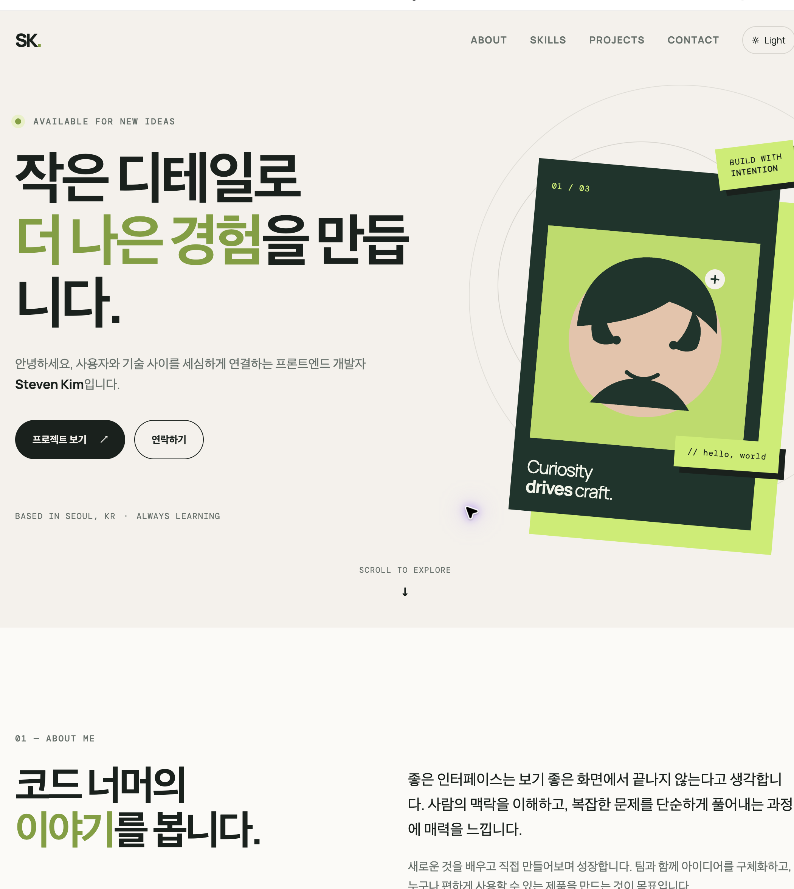
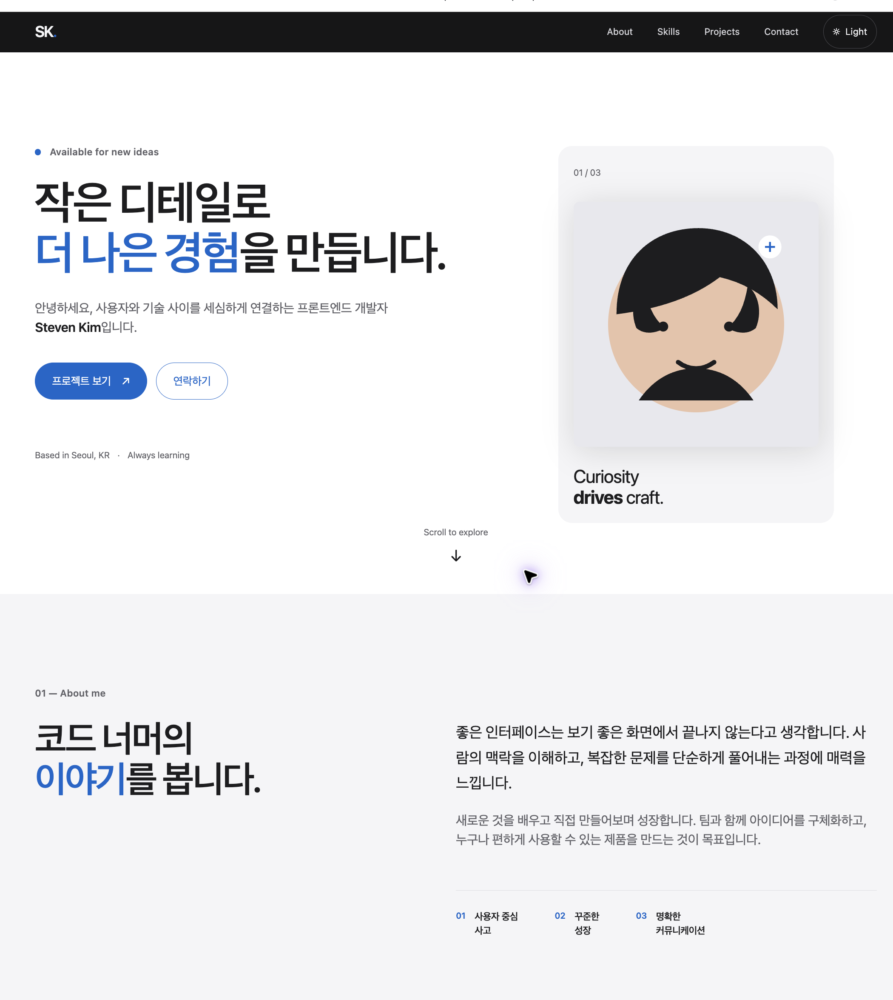
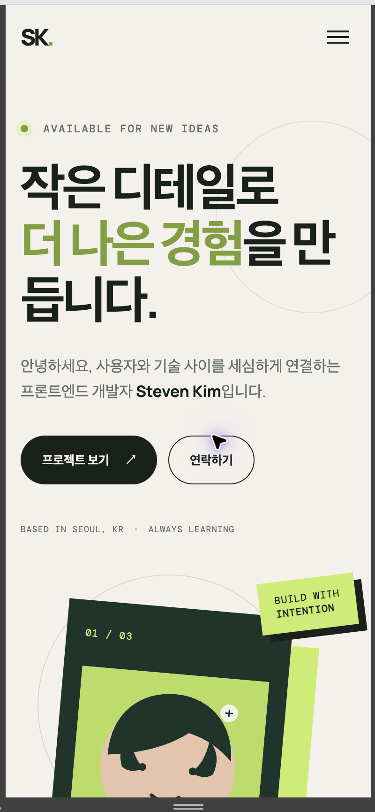
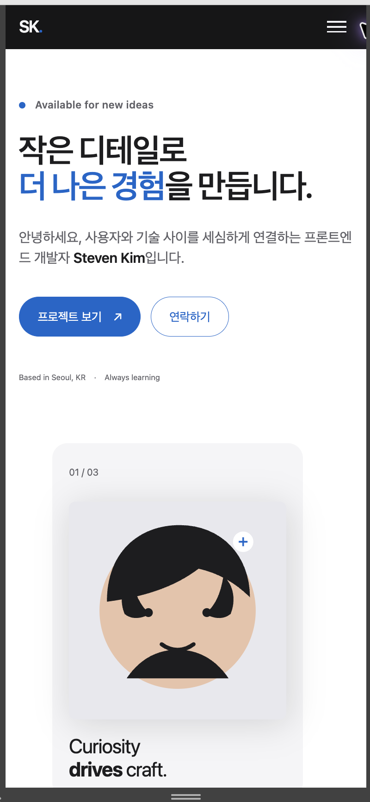
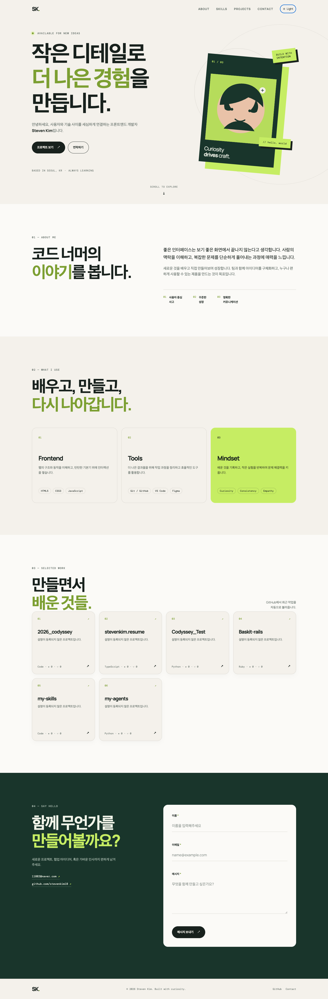
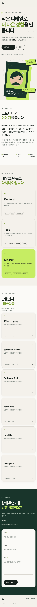
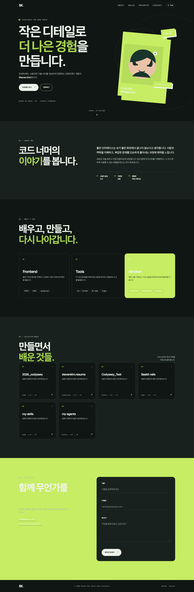

# Steven Kim 포트폴리오

순수 HTML, CSS, JavaScript로 만든 반응형 개인 포트폴리오입니다. 웹의 기본인 **이벤트 → 상태 변경 → DOM 렌더링** 흐름을 직접 구현하는 것을 목표로 했습니다.

## 배포

- GitHub 저장소: `https://github.com/stevenkim18/2026_codyssey`
- GitHub Pages: [https://stevenkim18.github.io/2026_codyssey/submissions/4-1/](https://stevenkim18.github.io/2026_codyssey/submissions/4-1/)

## 사용 기술

- HTML5 시맨틱 마크업
- CSS3 변수, Flexbox, Grid, 모바일 퍼스트 반응형 레이아웃
- Vanilla JavaScript (DOM API, 이벤트, `fetch`, `async/await`, Intersection Observer)
- GitHub REST API

## 디자인 기준

- [`DESIGN.md`](DESIGN.md): `npx getdesign@latest add apple`로 가져온 Apple 디자인 분석을 참고했습니다. Apple의 공식 디자인 시스템 문서는 아닙니다.
- 흰색/연회색과 어두운 섹션의 대비, 시스템 글꼴, 파란색 액션 버튼, 여백 중심의 구성을 포트폴리오에 맞게 적용했습니다. 과제의 다크 모드와 카드 그림자 요구사항을 고려해 원본 분석을 그대로 복제하지는 않았습니다.

## 설명 자료

- [프로젝트 개요와 평가 준비](docs/00-project-overview.md)
- [HTML과 CSS](docs/01-html-css.md)
- [JavaScript·DOM·이벤트](docs/02-javascript-dom-event.md)
- [GitHub API와 상태 관리](docs/03-api-state.md)
- [폼·localStorage·스크롤 애니메이션](docs/04-form-storage-animation.md)
- [실행·배포·접근성](docs/05-deployment-accessibility.md)

## 구현 기능

- 모바일 햄버거 메뉴: `classList.toggle('active')`로 열기/닫기
- 네비게이션 배경 변화: 스크롤 60px 이상
- 스크롤 탑 버튼: 스크롤 300px 이상
- Intersection Observer 스크롤 애니메이션: `threshold: 0.2`
- 라이트/다크 모드: `localStorage`의 `portfolio-theme` 키로 상태 유지
- GitHub 프로젝트: `stevenkim18`의 비포크·비아카이브 저장소를 최근 업데이트 순으로 최대 6개 표시
- API 상태: 로딩, 성공, 빈 목록, 에러 및 재시도 버튼
- 문의 폼: 이름·이메일·메시지 필수값과 이메일 형식 검증

## 로컬 실행

VS Code에서 `submissions/4-1` 폴더를 열고 Live Server로 `index.html`을 실행합니다. GitHub API는 브라우저에서 호출되므로 인터넷 연결이 필요합니다.

## 화면 미리보기

### 디자인 개선 비교 (2026-09-16)

같은 데스크톱/모바일 화면 크기에서 첫 화면을 캡처했습니다. 왼쪽은 현재 GitHub Pages에 배포된 기존 디자인이고, 오른쪽은 `DESIGN.md`를 적용한 로컬 수정본입니다. **오른쪽 디자인은 아직 배포되지 않았습니다.**

| 화면 | 배포본 (개선 전) | 로컬 수정본 (개선 후) |
| --- | --- | --- |
| 데스크톱 |  |  |
| 모바일 |  |  |

주요 변화: 베이지/연두색 중심의 장식적 화면을 흰색·연회색 캔버스와 파란색 액션 컬러로 단순화하고, 헤더와 프로필 카드를 더 절제된 형태로 정리했습니다.

### 기존 제출 캡처

아래 이미지는 디자인 개선 전 제출 당시 캡처입니다.

## 제출 전 체크리스트

- [x] GitHub Pages 배포 URL 추가
- [x] 데스크톱 스크린샷 추가
- [x] 모바일 스크린샷 추가
- [x] 다크 모드 스크린샷 추가
- [x] `js/main.js`의 `githubUsername`과 소개 문구 확인
