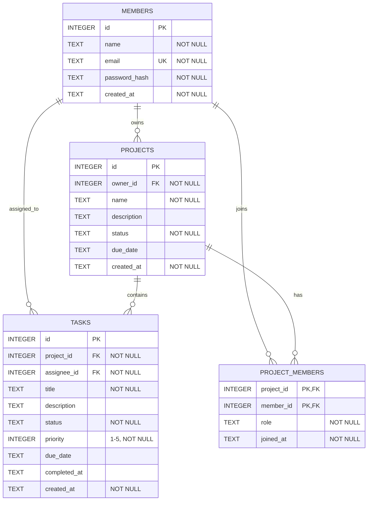

# 프로젝트 관리 툴 ERD

## 관계 설명

| 관계 | 설명 |
| --- | --- |
| `members 1:N projects` | 한 회원은 여러 프로젝트를 소유할 수 있다. `projects.owner_id`가 회원을 참조한다. |
| `projects 1:N tasks` | 하나의 프로젝트에는 여러 할 일이 포함될 수 있다. `tasks.project_id`가 프로젝트를 참조한다. |
| `members 1:N tasks` | 한 회원은 여러 할 일을 담당할 수 있다. `tasks.assignee_id`가 담당 회원을 참조한다. |
| `members N:M projects` | 한 회원이 여러 프로젝트에 참여하고, 한 프로젝트에 여러 회원이 참여할 수 있다. `project_members`가 연결 역할을 한다. |

## 제약조건

- 모든 테이블은 PK를 가진다.
- `members.email`은 `UNIQUE`라서 중복 가입을 막는다.
- 주요 입력 컬럼에는 `NOT NULL`을 적용한다.
- `projects.owner_id`, `tasks.project_id`, `tasks.assignee_id`, `project_members`의 두 컬럼은 FK로 연결된다.
- SQLite에서 `PRAGMA foreign_keys = ON`을 사용해 존재하지 않는 회원이나 프로젝트 참조를 막는다.
- `project_members`는 `(project_id, member_id)` 복합 PK를 사용해 같은 회원의 중복 참여를 막는다.
